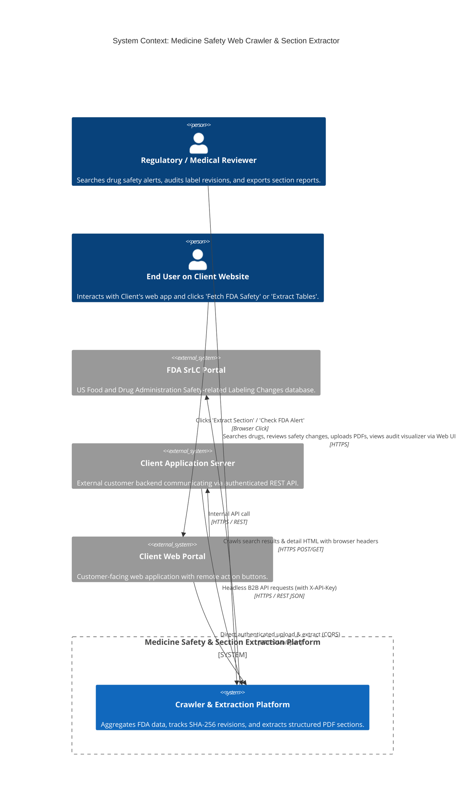
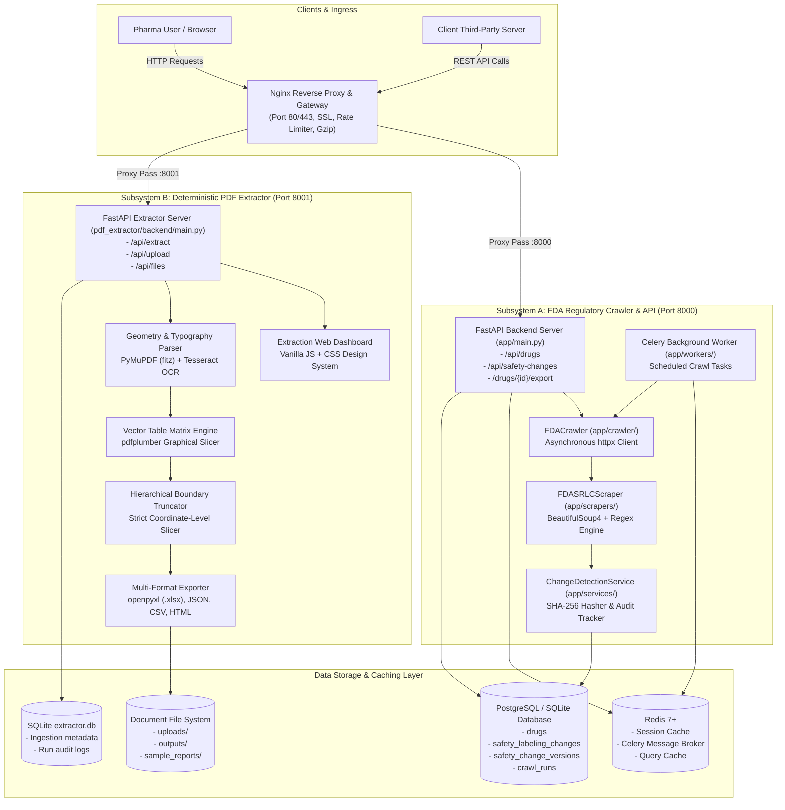
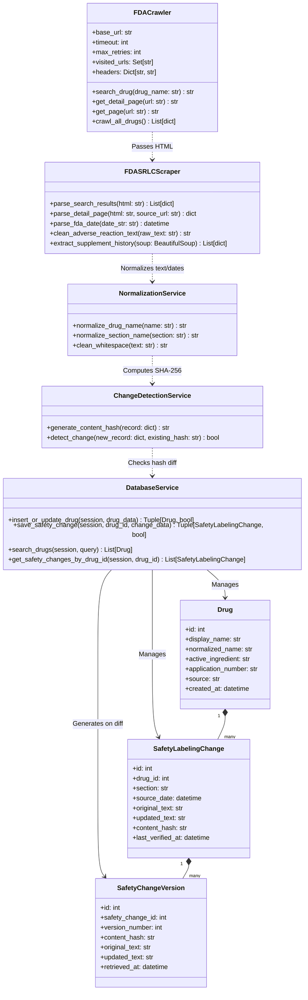
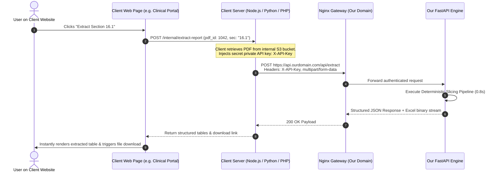
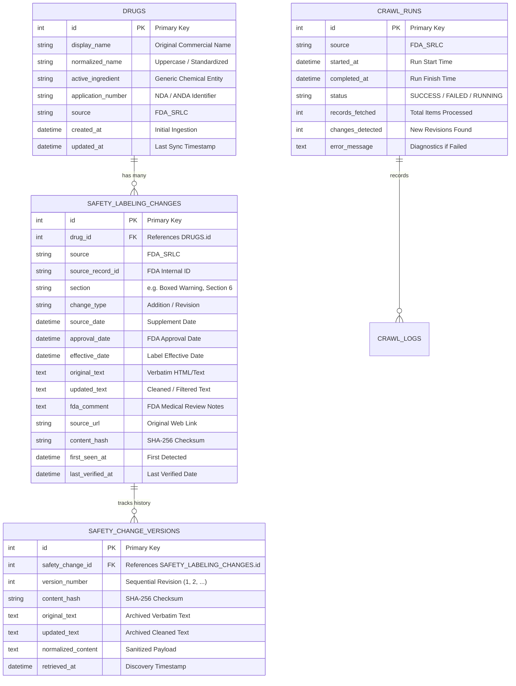

# Enterprise Architecture Blueprint: Web Crawler & Intelligent Section Extractor

> **Standard Compliance**: ISO/IEC 42010 / C4 Architecture Model (Context, Container, Component, Code)  
> **Repository**: `Satya0418/webcrawler`  
> **Core Subsystems**: FDA Regulatory Web Crawler (`backend/`) & Intelligent PDF Section Extractor (`pdf_extractor/`)  
> **Status**: Production-Grade Architectural Specification  

---

## 1. Executive Architectural Summary

The system is a high-reliability, dual-engine data ingestion and extraction platform engineered specifically for **life sciences, pharmaceutical compliance, and clinical regulatory intelligence**. 

It solves two critical, highly complex challenges:
1. **Autonomous FDA Regulatory Web Crawling & Change Detection**: Automatically traverses, queries, parses, normalizes, and cryptographically tracks revisions in the FDA Drug Safety-related Labeling Changes (SrLC) database without missing safety alerts or overwriting historical audit trails.
2. **Deterministic PDF Hierarchical Section Extraction**: Ingests dense, multi-hundred-page clinical reports (CSRs, PBRERs, PSURs) and slices specific subsections (such as *Section 16 → 16.1*) down to exact block-level coordinates, preserving vector-line tables and lists, **stopping strictly before sibling boundaries (16.2)** with **zero hallucination (0% LLM)**.

```
┌─────────────────────────────────────────────────────────────────────────────────────────────┐
│                                   THE COMPLETE PLATFORM                                     │
├──────────────────────────────────────────────┬──────────────────────────────────────────────┤
│        SUBSYSTEM A: REGULATORY CRAWLER       │         SUBSYSTEM B: SECTION EXTRACTOR       │
│  - Asynchronous HTTP Crawler (httpx)         │  - Geometric Text & Layout Engine (PyMuPDF)  │
│  - Resilient Session & Anti-Bot Engine       │  - Vector Line Table Extractor (pdfplumber)  │
│  - Biological Date & Section Parser (BS4)    │  - Multi-Signal Heading & TOC Classifier     │
│  - SHA-256 Change Detection & Audit Logs     │  - Strict Sibling Coordinate Slicer (16.2)   │
│  - Relational ORM Storage (PostgreSQL/SQLite)│  - Multi-Format Generator (XLSX, JSON, HTML) │
└──────────────────────────────────────────────┴──────────────────────────────────────────────┘
```

---

## 2. C4 Architecture Model - Level 1: System Context Diagram

The System Context diagram illustrates the system boundaries, human stakeholders, client ecosystems, and external data sources.



---

## 3. C4 Architecture Model - Level 2: Container Diagram

The Container diagram decomposes the platform into its high-level executable processes, data stores, background task workers, and edge gateways.



---

## 4. C4 Architecture Model - Level 3: Component Breakdown

### 4.1 Subsystem A: FDA Web Crawler & Ingestion Pipeline (`backend/app`)

This subsystem orchestrates web scraping, anti-bot mitigation, date parsing, sanitization, and non-destructive version history tracking.



#### Detailed Worker Pipeline
1. **`FDACrawler`** uses `httpx.AsyncClient` configured with full desktop browser impersonation (`User-Agent`, `Accept-Language`, `Sec-Fetch-*`, `Referer`), session cookies, and exponential backoff retry logic.
2. **`FDASRLCScraper`** parses HTML tables, handles ColdFusion pagination tokens, extracts supplement letters (`SUPPL-25`), normalizes dates across 8 distinct formats via `parse_fda_date`, and cleanly isolates section headers (e.g., *Boxed Warnings*, *Warnings and Precautions*, *Adverse Reactions*).
3. **`ChangeDetectionService`** takes canonical normalized attributes and computes an immutable `SHA-256` checksum.
4. **`DatabaseService`** detects whether a safety change has been modified by the FDA. If a hash mismatch occurs, it archives the previous version into `SafetyChangeVersion` with an incremental version index and updates the primary record in-place.

---

### 4.2 Subsystem B: Intelligent PDF Section Extractor (`pdf_extractor/backend`)

The PDF extraction engine is a multi-pass geometric document compiler.

```mermaid
graph TD
    InputPDF["Input PDF Document<br/>(Local path or uploaded bytes)"] --> Step1["Step 1: Ingestion & Sanity Checks<br/>(backend/pdf/reader.py)<br/>• PyMuPDF (fitz) verification<br/>• Scanned density detection (&lt;50 chars) ──► Tesseract OCR"]
    Step1 --> Step2["Step 2: Typography & Layout Engine<br/>(backend/pdf/parser.py)<br/>• Compute Statistical Body Font Size (mode pt)<br/>• Sort reading blocks: (page, round(y0/4)*4, x0)<br/>• Extract bullet & list syntax"]
    Step2 --> Step3["Step 3: Margin & Noise Filtration<br/>(backend/pdf/cleaner.py)<br/>• Exclude running headers (top 12% margin)<br/>• Exclude running footers (bottom 10% margin)<br/>• Strip repeating pagination tokens"]
    Step3 --> Step4["Step 4: Multi-Signal Heading Classifier<br/>(backend/extraction/heading_detector.py)<br/>• Font scale: size &gt; 1.08 * body_size OR bold<br/>• Regex prefix: match '16', '16.1', '16.1.1'<br/>• TOC Filter: Reject dot-leaders (...) & page digits"]
    Step4 --> Step5["Step 5: Graphical Table Matrix Extractor<br/>(backend/extraction/table_extractor.py)<br/>• pdfplumber vector line intersections<br/>• Cell boundary snapping & header alignment<br/>• Deduplicate underlying text spans"]
    Step5 --> Step6["Step 6: Hierarchical Tree Assembler<br/>(backend/extraction/tree_builder.py)<br/>• Build DocumentTree (16 ──► 16.1 ──► 16.1.1)<br/>• Bind paragraphs, tables, and lists to nodes"]
    Step6 --> Step7["Step 7: Sibling Boundary Coordinate Slicer<br/>(backend/extraction/boundary_detector.py)<br/>• Locate start of 16.1 (page, y0)<br/>• Locate start of sibling 16.2 (page, y0)<br/>• Truncate EXACTLY before 16.2 even on same page"]
    Step7 --> Step8["Step 8: Automated Quality & Audit Verification<br/>(backend/audit/validator.py)<br/>• Calculate Confidence Score (0.0 - 1.0)<br/>• Verify target exists & sibling is 100% excluded"]
    Step8 --> Step9["Step 9: Multi-Format Exporter<br/>(backend/exporters/)<br/>• Excel (.xlsx via openpyxl with styles)<br/>• Deep JSON Tree & Semantic HTML<br/>• Normalized Flat CSV & Plain Text"]
```



---

## 5. C4 Architecture Model - Level 4: Code & Data Flow Architecture

### 5.1 Flow 1: Live On-Demand Web Crawling & SHA-256 Versioning

When a user searches for a medicine (e.g., *"Ciprofloxacin"*) or when the scheduled worker runs:

```mermaid
sequenceDiagram
    autonumber
    actor User as Pharma User / API Client
    participant API as FastAPI Router (app/api/drugs.py)
    participant DB as PostgreSQL / SQLite
    participant Crawler as FDACrawler (app/crawler/)
    participant FDA as FDA Remote Server (fda.gov)
    participant Scraper as FDASRLCScraper (app/scrapers/)
    participant CD as ChangeDetectionService
    participant Vers as DatabaseService (Version Tracker)

    User->>API: GET /api/drugs/search?q=Ciprofloxacin
    API->>DB: Query local drugs table
    alt Record found and fresh (&lt; 24h)
        DB-->>API: Return cached Drug & SafetyChanges
        API-->>User: Return 200 OK (Instant Response)
    else Record missing or stale
        API->>Crawler: search_drug("Ciprofloxacin")
        Crawler->>FDA: POST /index.cfm?event=searchResult.page (data={"drug_name": "Ciprofloxacin"})
        FDA-->>Crawler: Return HTML Search Results
        Crawler->>Scraper: parse_search_results(html)
        Scraper-->>Crawler: Return [{drug_name, detail_url, source_date}, ...]
        loop For Top Search Matches
            Crawler->>FDA: GET /detail_url (Browser Headers & Cookie)
            FDA-->>Crawler: Return Detail HTML Page
            Crawler->>Scraper: parse_detail_page(html)
            Scraper-->>Crawler: Return {active_ingredient, application_no, safety_changes: [...]}
            Crawler->>CD: generate_content_hash(safety_change)
            CD-->>Crawler: Return SHA-256 Checksum
            Crawler->>Vers: save_safety_change(drug_id, change_data)
            alt Content hash differs from existing DB record
                Vers->>DB: INSERT into safety_change_versions (prev_content, version_no)
                Vers->>DB: UPDATE safety_labeling_changes (updated_text, new_hash, last_verified_at)
            else Content hash matches
                Vers->>DB: UPDATE safety_labeling_changes (last_verified_at = now())
            end
        end
        DB-->>API: Fetch updated records
        API-->>User: Return 200 OK with Live Revisions & Formatted Adverse Reactions
    end
```

---

### 5.2 Flow 2: 100% Deterministic PDF Section Slicing

When an operator or remote client requests extraction of `Section 16 -> 16.1`:

```mermaid
sequenceDiagram
    autonumber
    actor Client as Client App / Dashboard
    participant API as Extractor API (pdf_extractor/backend/main.py)
    participant Reader as PDFReader (PyMuPDF fitz)
    participant OCR as Tesseract Fallback Engine
    participant Parser as Layout & Typography Engine
    participant Table as TableExtractor (pdfplumber)
    participant Bound as Boundary & Tree Slicer
    participant Audit as Audit & Quality Validator
    participant Export as Multi-Format Exporter

    Client->>API: POST /api/extract (file: report.pdf, section: "16", subsection: "16.1")
    API->>Reader: open_document(file_bytes)
    alt Scanned PDF (&lt; 50 chars/page)
        Reader->>OCR: Run Tesseract OCR on page raster
        OCR-->>Reader: Return OCR transcribed text spans
    end
    Reader-->>API: Document object & page count

    API->>Parser: analyze_typography_and_blocks(doc)
    Note over Parser: 1. Compute statistical body font size (e.g. 10.5pt)<br/>2. Discard top 12% (headers) & bottom 10% (footers)<br/>3. Sort blocks: (page, round(y0/4)*4, x0)
    Parser-->>API: Filtered block streams

    API->>Table: extract_tables_with_geometry(doc)
    Note over Table: Detect vector graphical lines via pdfplumber.<br/>Extract rows, columns, and rectangular cell bounds.
    Table-->>API: Structured table matrices with bboxes

    API->>Bound: slice_hierarchical_section(target="16.1", stop_before="16.2")
    Note over Bound: Sibling Boundary Rule:<br/>Scan blocks until 16.1 is reached (Start Bound).<br/>Collect all descendant blocks (16.1.1, tables, text).<br/>IMMEDIATELY STOP when 16.2 heading is detected,<br/>even if 16.1 and 16.2 share the same physical page!
    Bound-->>API: Extracted section block slice

    API->>Audit: validate_extraction(slice, target="16.1", stop="16.2")
    Note over Audit: Run 5-point verification:<br/>• Parent heading verified?<br/>• Target heading verified?<br/>• Subsections included?<br/>• Tables captured?<br/>• Sibling 16.2 STRICTLY absent?
    Audit-->>API: Confidence Score: 1.0 (Audit Passed)

    API->>Export: generate_exports(slice)
    Export-->>API: Paths to .xlsx (openpyxl styled), .json, .csv, .html
    API-->>Client: 200 OK JSON (text, tables, confidence: 1.0, download_urls)
```

---

### 5.3 Flow 3: Headless Client Remote Button Integration

How third-party client websites trigger the extractor from a custom button on their own webpage:



---

## 6. Data Models & Entity-Relationship Architecture (ERD)

The relational schema strictly models drugs, safety labeling modifications, multi-version audit histories, and crawl runs.



---

## 7. Anti-Scraping, Resiliency & Fault-Tolerance Architecture

Web crawling government repositories requires rigorous defenses against IP bans, rate limits, and network volatility.

| Challenge | Failure Mode | Architectural Defense Implemented |
| :--- | :--- | :--- |
| **FDA Bot Mitigation (HTTP 403 / 429)** | Server drops automated Python requests | • Exact browser header emulation (`User-Agent`, `Sec-Ch-Ua`, `Accept-Language`, `Referer`)<br/>• Session cookie maintenance via `httpx.AsyncClient`<br/>• Configurable crawl delays between requests |
| **Network Latency & Socket Dropouts** | Connection timeouts during long searches | • Configurable timeout (`FDA_CRAWL_TIMEOUT = 30s`)<br/>• Exponential backoff: $t = \text{base} \times 2^{\text{attempt}} + \text{jitter}$<br/>• Max retries (`FDA_CRAWL_RETRIES = 3`) |
| **ColdFusion State & Dynamic Pagination** | Unpredictable pagination state | • In-memory visited URL deduplication set (`self.visited_urls`)<br/>• Direct POST query targeting `index.cfm?event=searchResult.page` |
| **Inconsistent Date Representations** | Date comparison failures across formats | • Multi-regex parser (`parse_fda_date`): Handles `MM/DD/YYYY`, `M/D/YYYY`, `ISO-8601`, `05-Dec-2025`, `June 25, 2026`<br/>• Strips supplement metadata like `(SUPPL-25)` prior to parsing |
| **Clinical Noise Contamination** | Section 17, Patient Guides leaking into Adverse Reactions | • `clean_adverse_reaction_text`: Hard cutoff regex stopping before Section 17, PCI, PI, or Medication Guides<br/>• Bracketed cross-reference removal: `[see Warnings and Precautions (5.5)]` |
| **Data Integrity & Overwrite Loss** | Label revisions overwriting historical alerts | • Cryptographic `SHA-256` content hashing<br/>• Non-destructive versioning (`SafetyChangeVersion`) preserves full historical lineage |
| **Corrupted or Scanned PDFs** | Blank extraction results from scanned image PDFs | • Automated character-density heuristics ($< 50 \text{ chars/page}$)<br/>• Transparent fallback to Tesseract OCR with automatic image pre-processing |

---

## 8. Why 100% Deterministic (Zero-LLM) Extraction?

For pharmaceutical, clinical, and legal document processing, deterministic code guarantees outcomes that Large Language Models cannot match:

```
┌──────────────────────────────┬──────────────────────────────┬──────────────────────────────┐
│ DIMENSION                    │ OUR DETERMINISTIC ENGINE     │ LLM-BASED EXTRACTION         │
├──────────────────────────────┼──────────────────────────────┼──────────────────────────────┤
│ Hallucination Risk           │ 0.00% (Verbatim ground-truth)│ 2.0% - 15.0% (Altered digits)│
│ Table Geometry & Borders     │ Exact vector coordinate grid │ Merged, flattened, truncated │
│ Intra-Page Boundary Cutoffs  │ Microscopic pixel truncation │ Fails spatial boundary cutoffs│
│ Processing Speed (100+ pages)│ 0.3s - 1.5s                  │ 15s - 90s+ (token-bound)     │
│ Operational Cost             │ $0.00 per extraction         │ Expensive API token charges  │
│ Regulatory Compliance & Audit│ 100% Auditable bounding boxes│ Black-box non-reproducible   │
│ Data Privacy (HIPAA / GDPR)  │ 100% Local, zero third-party │ Transmits data to AI vendor  │
└──────────────────────────────┴──────────────────────────────┴──────────────────────────────┘
```

---

## 9. Security, Ingress & Production Deployment Topology

The system is configured for enterprise deployment with Nginx as a reverse proxy, systemd process supervision, and API Key authentication.

```
 Internet / Client Applications
                │
                │ HTTPS (Port 443 / TLS 1.3)
                ▼
┌────────────────────────────────────────────────────────┐
│               Nginx Edge Reverse Proxy                 │
│  - SSL Termination (Let's Encrypt / DigiCert)          │
│  - Rate Limiting (limit_req zone=api_limit burst=20)   │
│  - Max Body Size: 100M (PDF uploads)                   │
│  - Gzip Compression for JSON & Static assets           │
└───────────────┬────────────────────────┬───────────────┘
                │                        │
                │ Proxy Pass             │ Proxy Pass
                ▼ :8000                  ▼ :8001
┌───────────────────────────────┐ ┌──────────────────────────────┐
│  FastAPI Regulatory Crawler   │ │  FastAPI PDF Extractor       │
│  (systemd: medicine-safety)   │ │  (systemd: pdf-extractor)    │
│  - Worker: Uvicorn ASGI       │ │  - Worker: Uvicorn ASGI      │
│  - Workers: 4 processes       │ │  - Workers: 4 processes      │
└───────────────┬───────────────┘ └──────────────┬───────────────┘
                │                                │
                ▼                                ▼
┌───────────────────────────────┐ ┌──────────────────────────────┐
│  Redis & Celery Task Broker   │ │  Local File System & SQLite  │
│  - Scheduled nightly sync     │ │  - uploads/ & outputs/       │
│  - Asynchronous background job│ │  - extractor.db audit traces │
└───────────────┬───────────────┘ └──────────────────────────────┘
                │
                ▼
┌───────────────────────────────┐
│  PostgreSQL 14+ Relational DB │
│  - Connection pooling (SQLAlc)│
│  - ACID transaction isolation │
└───────────────────────────────┘
```

---

## 10. Repository Codebase Mapping

| Subsystem | File / Component | Architectural Role |
| :--- | :--- | :--- |
| **Crawler & Ingress** | [`backend/app/crawler/fda_crawler.py`](file:///Users/satya/Desktop/webcrwler/backend/app/crawler/fda_crawler.py) | Asynchronous HTTP crawler with anti-bot headers and retry logic. |
| **HTML Parser** | [`backend/app/scrapers/fda_srlc_scraper.py`](file:///Users/satya/Desktop/webcrwler/backend/app/scrapers/fda_srlc_scraper.py) | Robust BS4 parser, multi-regex date parser, clinical noise cleaner. |
| **Change Detection** | [`backend/app/services/change_detection.py`](file:///Users/satya/Desktop/webcrwler/backend/app/services/change_detection.py) | SHA-256 cryptographic hashing service. |
| **Database ORM** | [`backend/app/models/drug.py`](file:///Users/satya/Desktop/webcrwler/backend/app/models/drug.py) | SQLAlchemy schema definitions for Drug, Changes, Versions, CrawlRuns. |
| **DB Service** | [`backend/app/services/database_service.py`](file:///Users/satya/Desktop/webcrwler/backend/app/services/database_service.py) | Upsert logic, version archiving, deduplication, search indexer. |
| **REST Router** | [`backend/app/main.py`](file:///Users/satya/Desktop/webcrwler/backend/app/main.py) | FastAPI application factory, search, detail, and export endpoints. |
| **PDF Reader** | [`pdf_extractor/backend/pdf/reader.py`](file:///Users/satya/Desktop/webcrwler/pdf_extractor/backend/pdf/reader.py) | PyMuPDF (fitz) document loader, geometry extraction, OCR trigger. |
| **Typography Parser**| [`pdf_extractor/backend/pdf/parser.py`](file:///Users/satya/Desktop/webcrwler/pdf_extractor/backend/pdf/parser.py) | Statistical body font calculation, block sorting, bullet parser. |
| **Noise Cleaner** | [`pdf_extractor/backend/pdf/cleaner.py`](file:///Users/satya/Desktop/webcrwler/pdf_extractor/backend/pdf/cleaner.py) | Running header and footer margin elimination engine. |
| **Heading Detector**| [`pdf_extractor/backend/extraction/heading_detector.py`](file:///Users/satya/Desktop/webcrwler/pdf_extractor/backend/extraction/heading_detector.py) | Multi-signal classifier & table-of-contents discriminator. |
| **Boundary Slicer** | [`pdf_extractor/backend/extraction/boundary_detector.py`](file:///Users/satya/Desktop/webcrwler/pdf_extractor/backend/extraction/boundary_detector.py) | Strict sibling boundary coordinate truncator. |
| **Table Extractor** | [`pdf_extractor/backend/extraction/table_extractor.py`](file:///Users/satya/Desktop/webcrwler/pdf_extractor/backend/extraction/table_extractor.py) | Vector graphical line and cell matrix extractor via `pdfplumber`. |
| **Exporters** | [`pdf_extractor/backend/exporters/`](file:///Users/satya/Desktop/webcrwler/pdf_extractor/backend/exporters) | Excel `.xlsx` generator, JSON tree builder, CSV, HTML formatters. |
| **Ingress Config** | [`nginx/medicine_safety.conf`](file:///Users/satya/Desktop/webcrwler/nginx/medicine_safety.conf) | Production Nginx reverse proxy configuration. |
| **Supervisor** | [`systemd/medicine-safety.service`](file:///Users/satya/Desktop/webcrwler/systemd/medicine-safety.service) | Production systemd unit service file. |
