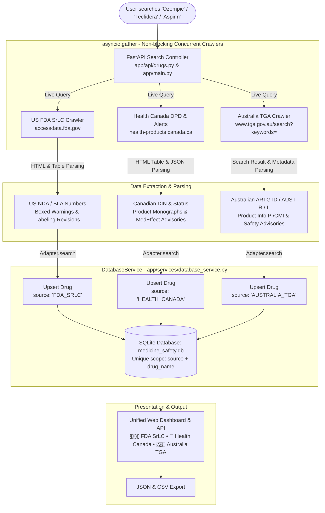

# Multi-Authority Medicine Safety: Data Processing & Database Architecture

This document specifies the technical architecture and end-to-end data processing pipeline for the **Medicine Safety Web Crawler Platform**. It details how data from international regulatory authorities is concurrently crawled, parsed, normalized, and saved into the SQLite database.

---

## 1. Tri-Authority Data Processing & Database Architecture

Below is the architecture diagram illustrating the workflow across **US FDA SrLC**, **Health Canada (DPD + InfoWatch)**, and **Australia TGA**:



---

## 2. Comprehensive Penta-Authority Architecture

With the addition of **FDA MedWatch** and the **UK MHRA Drug Safety Update**, the platform now queries 5 global regulatory authorities simultaneously:

```mermaid
flowchart TD
    Client([Client Request: GET /api/drugs/search?q={medicine}&source=ALL]) --> Dispatcher[FastAPI Orchestration Layer<br/>app/api/drugs.py]

    subgraph Authorities [5 Concurrent Regulatory Crawler Streams]
        Dispatcher -->|Stream 1| S1[🇺🇸 US FDA SrLC Scraper<br/>app/scrapers/fda_srlc_scraper.py]
        Dispatcher -->|Stream 2| S2[🍁 Health Canada DPD & InfoWatch<br/>app/sources/health_canada/]
        Dispatcher -->|Stream 3| S3[🇦🇺 Australia TGA Crawler<br/>app/sources/australia_tga/]
        Dispatcher -->|Stream 4| S4[🚨 FDA MedWatch & FAERS<br/>app/sources/fda_medwatch/]
        Dispatcher -->|Stream 5| S5[🇬🇧 UK MHRA Drug Safety Update<br/>app/sources/uk_mhra/]
    end

    subgraph Adapters [Data Normalization & Mapping Layer]
        S1 --> A1[FDA Adapter<br/>source: FDA_SRLC<br/>Key: NDA/BLA]
        S2 --> A2[Canada Adapter<br/>source: HEALTH_CANADA<br/>Key: DIN]
        S3 --> A3[TGA Adapter<br/>source: AUSTRALIA_TGA<br/>Key: AUST R/L]
        S4 --> A4[MedWatch Adapter<br/>source: FDA_MEDWATCH<br/>Key: MW-FAERS / MW-RECALL]
        S5 --> A5[UK MHRA Adapter<br/>source: UK_MHRA<br/>Key: PL / PLGB]
    end

    subgraph Storage [SQLite Relational Storage: medicine_safety.db]
        A1 & A2 & A3 & A4 & A5 --> DBService[DatabaseService<br/>app/services/database_service.py]
        DBService -->|Upsert Drugs Table| DrugsTable[(drugs table<br/>drug_id, drug_name, active_ingredient,<br/>application_number, source)]
        DBService -->|Insert Safety Changes| ChangesTable[(safety_labeling_changes table<br/>change_id, drug_id, section_name,<br/>summary, description, change_date)]
    end

    subgraph Consumer [Consumer Interfaces]
        DrugsTable & ChangesTable --> WebUI[Web Search & Drug Detail UI<br/>app/ui.py]
        DrugsTable & ChangesTable --> REST[REST API JSON Endpoints<br/>/api/drugs/search]
        DrugsTable & ChangesTable --> CSVExp[Instant CSV / JSON Downloader]
    end
```

---

## 3. End-to-End Data Pipeline Details

### Step 1: Request Dispatching (`app/api/drugs.py` & `app/main.py`)
- User inputs a search term (e.g., `Ozempic`).
- If `source=ALL` (default), the server triggers an asynchronous pipeline using `asyncio.gather(*tasks, return_exceptions=True)`.
- If a specific source is selected (`FDA_SRLC`, `HEALTH_CANADA`, `AUSTRALIA_TGA`, `FDA_MEDWATCH`, or `UK_MHRA`), only that adapter runs.

### Step 2: Target Authorities & Data Extraction

| Authority | Source Code / Module | Target URL / Protocol | Extracted Metadata |
| :--- | :--- | :--- | :--- |
| **🇺🇸 US FDA SrLC** | [fda_srlc_scraper.py](file:///Users/satya/Desktop/webcrwler/backend/app/scrapers/fda_srlc_scraper.py) | `accessdata.fda.gov/scripts/cder/safetylabelingchanges/` | Application Number (`NDA-XXXXXX` / `BLA-XXXXXX`), Boxed Warnings, Warnings and Precautions, Drug Interactions, Adverse Reactions. |
| **🍁 Health Canada** | [dpd_crawler.py](file:///Users/satya/Desktop/webcrwler/backend/app/sources/health_canada/dpd_crawler.py) & [adapter.py](file:///Users/satya/Desktop/webcrwler/backend/app/sources/health_canada/infowatch/adapter.py) | `health-products.canada.ca/dpd-bdpp/` & `recalls-rappels.canada.ca` | Drug Identification Number (`DIN XXXXXXXX`), Dosage form, Route, Status (Marketed), Product Monograph links, InfoWatch advisories. |
| **🇦🇺 Australia TGA** | [tga_crawler.py](file:///Users/satya/Desktop/webcrwler/backend/app/sources/australia_tga/tga_crawler.py) | `www.tga.gov.au/search?keywords=` | Australian Register of Therapeutic Goods (`AUST R XXXXXX` / `AUST L XXXXXX`), Sponsor name, Product Information (PI), Consumer Medicine Information (CMI). |
| **🚨 FDA MedWatch** | [medwatch_crawler.py](file:///Users/satya/Desktop/webcrwler/backend/app/sources/fda_medwatch/medwatch_crawler.py) | `fda.gov/safety/medwatch` & OpenFDA FAERS API | MedWatch Safety Alerts, Post-marketing FAERS signals, Class I/II/III enforcement recalls, Form 3500/3500B direct reporting portal. |
| **🇬🇧 UK MHRA** | [mhra_crawler.py](file:///Users/satya/Desktop/webcrwler/backend/app/sources/uk_mhra/mhra_crawler.py) | `gov.uk/drug-safety-update.json?keywords=` & `yellowcard.mhra.gov.uk` | UK Product Licence (`PL XXXXX/XXXX` / `PLGB XXXXX/XXXX`), Monthly Drug Safety Update articles, Clinical advice for healthcare professionals, Yellow Card reporting link. |

### Step 3: Normalization & Adapter Pattern
Each data source implements a clean adapter pattern ([UKMHRAAdapter](file:///Users/satya/Desktop/webcrwler/backend/app/sources/uk_mhra/adapter.py), [AustraliaTGAAdapter](file:///Users/satya/Desktop/webcrwler/backend/app/sources/australia_tga/adapter.py), [FDAMedWatchAdapter](file:///Users/satya/Desktop/webcrwler/backend/app/sources/fda_medwatch/adapter.py)):
1. Checks local SQLite database for existing records (instant response if cached).
2. If absent or stale, queries upstream authority with robust timeout (4.0s) and browser headers.
3. Normalizes payloads into standard dictionary structure:
   ```python
   {
       "drug_name": str,
       "active_ingredient": str,
       "application_number": str,  # NDA, DIN, AUST R, MW-FAERS, or PL/PLGB
       "source": str,              # FDA_SRLC, HEALTH_CANADA, AUSTRALIA_TGA, FDA_MEDWATCH, UK_MHRA
       "safety_changes": [
           {
               "section_name": str,
               "summary": str,
               "description": str,
               "change_date": datetime
           }
       ]
   }
   ```

### Step 4: Database Storage & Collision Prevention (`DatabaseService`)
- SQLite database location: `/Users/satya/Desktop/webcrwler/backend/medicine_safety.db`
- **Multi-Authority Coexistence Rule**:
  Because different countries regulate the same drug name (e.g. `Ozempic` exists in the US, Canada, Australia, and the UK), records are stored with their distinct `source` identifier.
- **Relational Tables**:
  - `drugs`: Primary entity with `drug_id`, `drug_name`, `active_ingredient`, `application_number`, `source`, `created_at`, `last_verified_at`.
  - `safety_labeling_changes`: Child table referencing `drug_id`, containing detailed safety advisories, clinical guidance, and labeling history.
  - `safety_change_versions`: Audit trail storing cryptographic hashes (`sha256`) of content versions to detect regulatory updates over time.

---

## 4. Verification and Execution

To query the pipeline and verify database persistence:

```bash
# Query all 5 authorities simultaneously
curl -s "http://127.0.0.1:8000/api/drugs/search?q=Ozempic&source=ALL"

# Query Australia TGA
curl -s "http://127.0.0.1:8000/api/drugs/search/australia-tga?q=Ozempic"

# Query UK MHRA
curl -s "http://127.0.0.1:8000/api/drugs/search/uk-mhra?q=Warfarin"

# Run automated test suite
cd backend && .venv/bin/pytest tests/ app/sources/ -v
```
