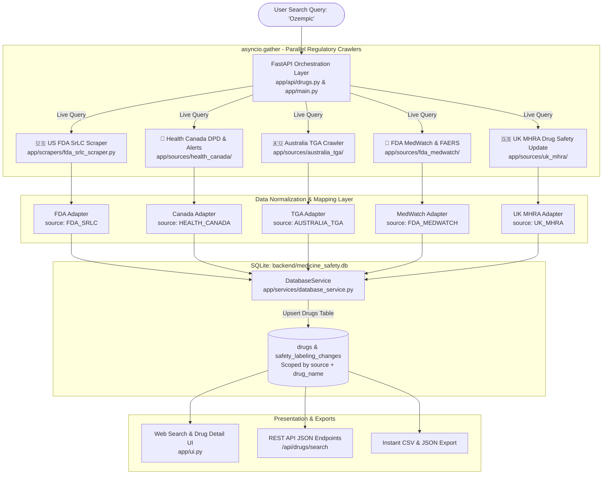

# Medicine Safety Intelligence & Multi-Authority Regulatory Platform

A high-reliability, multi-jurisdiction pharmaceutical intelligence platform that autonomously crawls, normalizes, detects safety revisions, and harmonizes drug safety data across **5 international health and regulatory authorities**, coupled with a deterministic PDF section extractor.

---

## 1. Supported Regulatory Authorities

Searching for any medicine (e.g., `Ozempic`, `Tecfidera`, `Aspirin`, `Warfarin`) queries all 5 regulatory authorities concurrently:

| Authority | Coverage & Domain | Key Identifiers | Primary Data Extracted |
| :--- | :--- | :--- | :--- |
| **🇺🇸 US FDA SrLC** | [accessdata.fda.gov](https://www.accessdata.fda.gov/scripts/cder/safetylabelingchanges/) | Application No. (`NDA`, `BLA`) | Prescription safety labeling changes, Boxed Warnings, Warnings and Precautions, Adverse Reactions. |
| **🍁 Health Canada** | [health-products.canada.ca](https://health-products.canada.ca/dpd-bdpp/) & InfoWatch | Drug Identification Number (`DIN`) | Marketed drug status, Product Monographs, Health Product InfoWatch advisories, Canadian safety alerts. |
| **🇦🇺 Australia TGA** | [tga.gov.au](https://www.tga.gov.au/search?keywords=) | Register of Therapeutic Goods (`AUST R`, `AUST L`) | Product Information (PI), Consumer Medicine Information (CMI), active ingredients, Australian safety alerts. |
| **🚨 FDA MedWatch** | [fda.gov/safety/medwatch](https://www.fda.gov/safety/medwatch) & FAERS | MedWatch ID (`MW-FAERS`, `MW-RECALL`) | Post-marketing surveillance signals, openFDA adverse event cases, Class I/II/III enforcement recalls, Form 3500 reporting. |
| **🇬🇧 UK MHRA** | [gov.uk/drug-safety-update](https://www.gov.uk/drug-safety-update) | UK Product Licence (`PL`, `PLGB`) | Monthly Drug Safety Update bulletins, CHM clinical advice, urgent safety alerts, UK Yellow Card incident reporting. |

---

## 2. Multi-Authority Processing Architecture



---

## 3. Documentation Directory

All architectural blueprints, developer guides, and milestone reports are organized under the [`docs/`](docs/) directory:

### 🏛️ Architecture
- [**Multi-Source Data Processing & DB Architecture**](docs/architecture/MULTI_SOURCE_DATA_PROCESSING_ARCHITECTURE.md): Deep-dive into data processing across all authorities and SQLite relational schema.
- [**Enterprise Architecture Blueprint (C4 Model)**](docs/architecture/ARCHITECTURE.md): Full ISO/IEC 42010 C4 architectural specification.
- [**Client Integration Architecture**](docs/architecture/CLIENT_INTEGRATION_ARCHITECTURE.md): Integration guide for external web portals and microservices.
- [**Interactive Architecture Visualizer**](docs/architecture/ARCHITECTURE_DIAGRAM.html): Interactive HTML visualization diagram.
- [**Visual Architecture Diagram**](docs/architecture/architecture_diagram.jpg): High-resolution schematic image.

### 📖 Guides
- [**Start Here**](docs/guides/START_HERE.md): Fast onboarding for new developers and stakeholders.
- [**Quickstart Guide**](docs/guides/QUICKSTART.md): Step-by-step local setup, environment configuration, and verification.
- [**How It Works**](docs/guides/HOW_IT_WORKS.md): Complete internal walkthrough of crawler mechanics, caching, and revision hashing.

### 🔌 Integration
- [**PDF Extractor Client Integration**](docs/integration/PDF_EXTRACTOR_CLIENT_INTEGRATION.md): API contract and integration guide for the PDF extraction subsystem.

### 📋 Reports & Milestones
- [**FDA Scraper Investigation Report**](docs/reports/FDA_INVESTIGATION_REPORT.md): Analysis of the FDA SrLC web portal, ASPX forms, and anti-bot mitigation.
- [**Phase 1 Completion Report**](docs/reports/PHASE1_COMPLETION.md): Core backend delivery summary and sign-off.
- [**Phase 2 Plan**](docs/reports/PHASE2_PLAN.md): Architectural roadmap and feature evolution plan.
- [**Session Summary**](docs/reports/SESSION_SUMMARY.md): Development trajectory, decisions, and system verification checklist.
- [**Files Created Inventory**](docs/reports/FILES_CREATED.md): Historical file breakdown and package inventory.

---

## 4. Repository Structure

```
webcrwler/
├── README.md                           # Master entrypoint & documentation directory
├── docs/                               # Reorganized documentation hierarchy
│   ├── architecture/                   # Architecture blueprints & visual diagrams
│   ├── guides/                         # Onboarding, quickstart, and how-it-works guides
│   ├── integration/                    # Subsystem integration specifications
│   └── reports/                        # Milestone reports, research audits, and roadmaps
├── backend/                            # FastAPI backend application
│   ├── app/
│   │   ├── api/                        # REST API routes (drugs, safety_changes, admin)
│   │   ├── sources/                    # Country-specific modular adapters
│   │   │   ├── australia_tga/          # 🇦🇺 Australia TGA crawler & adapter
│   │   │   ├── fda_medwatch/           # 🚨 FDA MedWatch & FAERS crawler & adapter
│   │   │   ├── health_canada/          # 🍁 Health Canada DPD & InfoWatch
│   │   │   └── uk_mhra/                # 🇬🇧 UK MHRA Drug Safety Update crawler & adapter
│   │   ├── scrapers/                   # 🇺🇸 US FDA SrLC Scraper engine
│   │   ├── crawler/                    # Asynchronous crawling coordinator
│   │   ├── models/ & schemas/          # SQLAlchemy ORM & Pydantic validation schemas
│   │   ├── services/                   # DatabaseService, normalization, change_detection
│   │   ├── workers/                    # Background polling and audit workers
│   │   ├── ui.py                       # Glassmorphic Web UI and multi-country detail pages
│   │   ├── main.py                     # FastAPI application factory & multi-gather route
│   │   └── database.py & config.py     # SQLite/PostgreSQL engine and settings
│   ├── tests/                          # Core test suites and fixtures
│   ├── scripts/
│   │   └── investigation/              # Scratch, verification, and manual investigation scripts
│   ├── medicine_safety.db              # Active SQLite persistence store
│   ├── pytest.ini                      # Pytest configuration (152 unit & integration tests)
│   └── requirements.txt                # Python backend dependencies
├── pdf_extractor/                      # Autonomous clinical PDF section extraction subsystem
├── scripts/                            # Production deployment and maintenance scripts
├── nginx/                              # Reverse proxy configuration
└── systemd/                            # Production systemd service unit files
```

---

## 5. Quickstart & Local Development

### Prerequisites
- Python 3.9+ (or virtual environment in `backend/.venv`)
- SQLite 3 (included)

### Running the Backend Server
```bash
cd backend
source .venv/bin/activate
uvicorn app.main:app --host 127.0.0.1 --port 8000 --reload
```

Open your browser at:
- **Web UI Search**: [http://127.0.0.1:8000/](http://127.0.0.1:8000/)
- **Interactive Swagger Docs**: [http://127.0.0.1:8000/docs](http://127.0.0.1:8000/docs)
- **ReDoc API Reference**: [http://127.0.0.1:8000/redoc](http://127.0.0.1:8000/redoc)

### Running Automated Tests
```bash
cd backend
.venv/bin/pytest tests/ app/sources/ -v
```
> **Test Results**: 152 passed (100% pass rate across all 5 regulatory test suites).

---

## 6. Live API Verification Commands

```bash
# Query all 5 authorities simultaneously:
curl -s "http://127.0.0.1:8000/api/drugs/search?q=Ozempic&source=ALL"

# Filter by Australia TGA:
curl -s "http://127.0.0.1:8000/api/drugs/search/australia-tga?q=Ozempic"

# Filter by FDA MedWatch:
curl -s "http://127.0.0.1:8000/api/drugs/search/fda-medwatch?q=Ozempic"

# Filter by UK MHRA:
curl -s "http://127.0.0.1:8000/api/drugs/search/uk-mhra?q=Warfarin"

# Filter by Health Canada:
curl -s "http://127.0.0.1:8000/api/drugs/search/health-canada?q=Ozempic"
```
