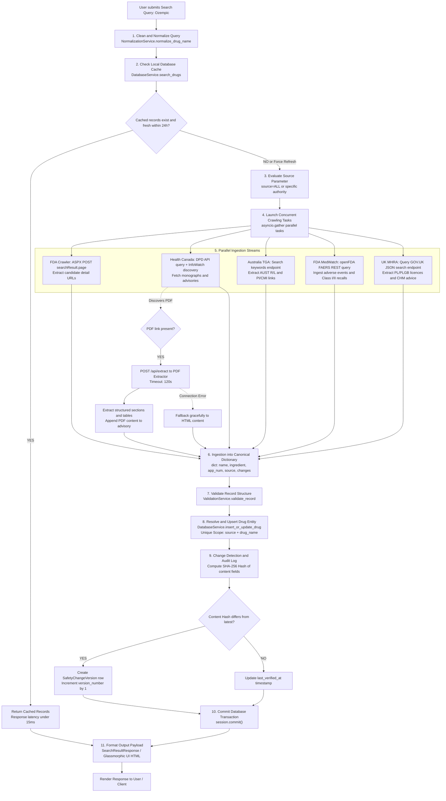

# Multi-Authority Medicine Safety & Intelligent PDF Extraction Platform
## Executive Architecture Diagram & System Blueprint

> **Notice**: This file contains the complete visual and interactive system architecture for direct viewing in markdown previewers and IDE editors.  
> **Full Architecture Documentation**: See [`docs/architecture/ARCHITECTURE.md`](docs/architecture/ARCHITECTURE.md)  
> **All Diagram Assets**: See [`docs/architecture/README.md`](docs/architecture/README.md)  

---

## 1. Interactive High-Resolution System Architecture

Below is the production vector diagram illustrating the complete system architecture across all 5 regulatory bodies, ingestion layers, document processing microservices, and databases.

---

## 2. Mermaid Live Architecture Diagram

```mermaid
flowchart TD
    User([User / Web Browser / API Client]) --> PresentationLayer

    subgraph PresentationLayer ["1. Presentation Layer"]
        UI["Medicine Safety Web Dashboard<br/>(app/ui.py - Glassmorphic SSR HTML/CSS/JS)"]
        PDFUI["PDF Extractor Dashboard<br/>(pdf_extractor/frontend - HTML/JS/CSS)"]
    end

    PresentationLayer --> APILayer

    subgraph APILayer ["2. Application & API Layer (FastAPI)"]
        MainApp["Medicine Safety API<br/>(app/main.py: Port 8000)"]
        DrugsRouter["Drugs Router<br/>(app/api/drugs.py)"]
        SafetyRouter["Safety Changes Router<br/>(app/api/safety_changes.py)"]
        AdminRouter["Admin Router<br/>(app/api/admin.py)"]
        PDFApp["PDF Extractor API<br/>(pdf_extractor/backend/main.py: Port 8001)"]
        ExtractionRouter["Extraction Router<br/>(backend/api/extraction.py)"]
        UploadRouter["Upload Router<br/>(backend/api/upload.py)"]
        
        MainApp --> DrugsRouter
        MainApp --> SafetyRouter
        MainApp --> AdminRouter
        PDFApp --> ExtractionRouter
        PDFApp --> UploadRouter
    end

    APILayer --> ServiceLayer

    subgraph ServiceLayer ["3. Core Services & Normalization Layer"]
        DBService["DatabaseService<br/>(app/services/database_service.py)"]
        NormService["NormalizationService<br/>(app/services/normalization.py)"]
        ValidService["ValidationService<br/>(app/services/validation.py)"]
        ChangeService["ChangeDetectionService<br/>(app/services/change_detection.py - SHA-256)"]
        CacheService["CacheService<br/>(app/services/cache.py)"]
        ExportService["ExportService<br/>(app/ui.py - CSV & JSON Generation)"]
    end

    APILayer --> Orchestrator

    subgraph Orchestrator ["4. Concurrent Ingestion Coordinator (asyncio.gather)"]
        AsyncGather{"asyncio.gather parallel tasks<br/>4.0s Timeout Ceiling & Error Isolation"}
    end

    Orchestrator --> RegulatoryAdapters

    subgraph RegulatoryAdapters ["5. Regulatory Source Adapters & Crawlers"]
        FDAEngine["FDA SrLC Crawler & Scraper<br/>(app/crawler/fda_crawler.py<br/>app/scrapers/fda_srlc_scraper.py)"]
        HCEngine["Health Canada DPD & InfoWatch<br/>(app/sources/health_canada/dpd_crawler.py<br/>infowatch/adapter.py)"]
        TGAEngine["Australia TGA Adapter & Crawler<br/>(app/sources/australia_tga/adapter.py<br/>tga_crawler.py)"]
        MWEngine["FDA MedWatch Adapter & Crawler<br/>(app/sources/fda_medwatch/adapter.py<br/>medwatch_crawler.py)"]
        MHRAEngine["UK MHRA Adapter & Crawler<br/>(app/sources/uk_mhra/adapter.py<br/>mhra_crawler.py)"]
    end

    RegulatoryAdapters --> ExternalWebsites

    subgraph ExternalWebsites ["6. External Regulatory Portals (The 5 Sources)"]
        ExtFDA["US FDA SrLC Portal<br/>(accessdata.fda.gov)"]
        ExtHC["Health Canada DPD & InfoWatch<br/>(health-products.canada.ca)"]
        ExtTGA["Australia TGA Portal<br/>(www.tga.gov.au/search)"]
        ExtMW["FDA MedWatch & openFDA<br/>(fda.gov/safety/medwatch & api.fda.gov)"]
        ExtMHRA["UK MHRA Drug Safety Update<br/>(www.gov.uk/drug-safety-update)"]
    end

    FDAEngine -.->|ASPX Form POST| ExtFDA
    HCEngine -.->|DPD API & Scrape| ExtHC
    TGAEngine -.->|Akamai-Resilient GET| ExtTGA
    MWEngine -.->|openFDA JSON & RSS| ExtMW
    MHRAEngine -.->|JSON API & ATOM| ExtMHRA

    HCEngine -->|HTTP POST /api/extract| PDFSubsystem

    subgraph PDFSubsystem ["7. Intelligent PDF/Document Extraction Subsystem"]
        SecExtractor["SectionExtractor<br/>(pdf_extractor/backend/extraction/)"]
        PDFReader["PDFReader & Layout Engine<br/>(PyMuPDF fitz)"]
        OCREngine["OCRDetector & Tesseract Fallback<br/>(pdf/ocr.py)"]
        HeadingDet["HeadingDetector<br/>(pdf/headings.py)"]
        TableExt["TableExtractor<br/>(pdfplumber graphical tables)"]
        BoundaryDet["BoundaryDetector<br/>(Coordinate-level Sibling Cutoff)"]

        SecExtractor --> PDFReader
        PDFReader --> HeadingDet
        HeadingDet --> TableExt
        TableExt --> BoundaryDet
        PDFReader -.->|Low Text Density| OCREngine
    end

    ServiceLayer --> PersistenceLayer
    PDFSubsystem --> PersistenceLayer

    subgraph PersistenceLayer ["8. Persistence Layer (SQLite Relational Databases)"]
        DBMain[("medicine_safety.db<br/>(drugs, safety_labeling_changes,<br/>safety_change_versions, crawl_runs)")]
        DBExtractor[("extractor.db<br/>(documents, extractions,<br/>content_blocks)")]
    end

    DBService --> DBMain
    PDFSubsystem --> DBExtractor
```

---

## 3. End-to-End Search & Ingestion Flow

---

## 4. The 5 Implemented Regulatory Authorities

| Jurisdiction | Authority Name | Implementation Files | Identifier | Primary Clinical Focus |
|---|---|---|---|---|
| **🇺🇸 United States** | **FDA Safety-related Labeling Changes (SrLC)** | `app/crawler/fda_crawler.py` `app/scrapers/fda_srlc_scraper.py` | NDA / BLA Number | Boxed Warnings, Warnings & Precautions, Adverse Reactions |
| **🍁 Canada** | **Health Canada DPD & InfoWatch** | `app/sources/health_canada/dpd_crawler.py` `infowatch/adapter.py` | 8-digit DIN | Product Monographs, Marketed Status, Recall Notices |
| **🇦🇺 Australia** | **Therapeutic Goods Administration (TGA)** | `app/sources/australia_tga/adapter.py` `tga_crawler.py` | ARTG AUST R / AUST L | PI/CMI Leaflets, Sponsor Data, Defect Alerts |
| **🚨 United States** | **FDA MedWatch & openFDA FAERS** | `app/sources/fda_medwatch/adapter.py` `medwatch_crawler.py` | MW-FAERS-ID | Post-Marketing Adverse Events, Hospitalizations, Class I/II Recalls |
| **🇬🇧 United Kingdom** | **UK MHRA Drug Safety Update** | `app/sources/uk_mhra/adapter.py` `mhra_crawler.py` | PL / PLGB Licence | CHM Clinical Advice, Drug Safety Updates, Yellow Card CTA |

---

## 5. Summary of Architecture Assets

All 13 architecture diagrams are available in editable `.mmd`, vector `.svg`, and raster `.png` formats in `docs/architecture/`:

1. `01-system-architecture` — Full System Architecture
2. `02-end-to-end-data-flow` — End-to-End Lifecycle
3. `03-five-regulatory-sources` — 5 Regulatory Sources Architecture
4. `04-crawler-architecture` — Parallel Ingestion Engine
5. `05-pdf-document-extraction` — PyMuPDF / pdfplumber / Tesseract Slicer
6. `06-medicine-search-flow` — Cache-Aside Search Flow
7. `07-database-architecture` — SQLite Schema & Entity Relationships
8. `08-backend-architecture` — FastAPI Router, Service, ORM Stack
9. `09-frontend-architecture` — Glassmorphic SSR Web Dashboard
10. `10-error-handling-flow` — Timeouts, WAF Blocks, Transaction Recovery
11. `11-security-access-flow` — Defensive Crawling, Rate Limits & Compliance
12. `12-current-architecture` — Current Implemented Architecture
13. `13-recommended-architecture` — Recommended Enterprise Target Architecture
