# Professional Software Architecture Documentation
## Medicine Regulatory Safety Intelligence & Intelligent Document Processing Platform

> **System Classification**: Distributed Multi-Authority Regulatory Surveillance & Deterministic Clinical Document Extraction Platform  
> **Status**: Production Architecture Specification  
> **Repository**: `Satya0418/webcrawler`  
> **Primary Frameworks**: FastAPI, SQLAlchemy, PyMuPDF (fitz), pdfplumber, Tesseract OCR, httpx  
> **Authoritative Sources Integrated**: 5 Global Regulatory Authorities  

---

## Table of Contents

1. [Project Overview](#1-project-overview)
2. [High-Level System Architecture](#2-high-level-system-architecture)
3. [Complete End-to-End Data Flow](#3-complete-end-to-end-data-flow)
4. [Five Implemented Regulatory Sources](#4-five-implemented-regulatory-sources)
5. [Crawler & Ingestion Architecture](#5-crawler--ingestion-architecture)
6. [Document Processing Pipeline](#6-document-processing-pipeline)
7. [Existing PDF / OCR Section Extraction Subsystem](#7-existing-pdf--ocr-section-extraction-subsystem)
8. [Medicine Search & Aggregation Flow](#8-medicine-search--aggregation-flow)
9. [Backend Architecture & Module Structure](#9-backend-architecture--module-structure)
10. [Frontend Architecture & Visualization](#10-frontend-architecture--visualization)
11. [Database Architecture & Entity Relationships](#11-database-architecture--entity-relationships)
12. [Error Handling & Fault Tolerance](#12-error-handling--fault-tolerance)
13. [Security & Access Handling](#13-security--access-handling)
14. [Current Implemented Architecture](#14-current-implemented-architecture)
15. [Recommended Enterprise Architecture](#15-recommended-enterprise-architecture)
16. [Current Architecture Limitations](#16-current-architecture-limitations)
17. [Component Responsibility Matrix](#17-component-responsibility-matrix)
18. [Source Comparison Matrix](#18-source-comparison-matrix)
19. [Actual Project Directory Structure](#19-actual-project-directory-structure)

---

## 1. Project Overview

### 1.1 Mission & Problem Statement
In pharmaceutical compliance, regulatory intelligence, and pharmacovigilance, medical officers and regulatory affairs teams must continuously monitor post-marketing safety alerts, boxed warnings, adverse reaction reports, and product monograph changes across multiple international regulatory jurisdictions. Traditionally, this process is fragmented, manual, and prone to oversight:
- Regulatory bodies (US FDA, Health Canada, Australia TGA, UK MHRA) publish safety advisories across disparate web portals with divergent protocols (ASP.NET ViewState forms, REST APIs, ATOM/RSS feeds, and static HTML).
- Official drug product monographs and safety updates are frequently published as dense, multi-hundred-page clinical PDFs (CSRs, PSURs, PBRERs) where critical updates (such as Boxed Warnings or Section 16 Clinical Data) are buried and difficult to extract deterministically without hallucinations.

The **Medicine Regulatory Safety Intelligence Platform** solves this by providing:
1. **Unified Multi-Jurisdiction Regulatory Aggregator**: Integrates 5 global regulatory authorities into a single, high-performance querying interface with cryptographic change detection (SHA-256 versioning).
2. **Deterministic Clinical Document Extractor**: Slices dense pharmaceutical PDFs into structured, coordinate-level sections and tables with 100% mathematical precision and zero LLM hallucinations.

### 1.2 Major Subsystems
The repository consists of two integrated subsystems:

```
┌─────────────────────────────────────────────────────────────────────────────────────────────┐
│                       MEDICINE REGULATORY SAFETY INTELLIGENCE PLATFORM                      │
├──────────────────────────────────────────────┬──────────────────────────────────────────────┤
│    SUBSYSTEM 1: MEDICINE SAFETY PLATFORM     │    SUBSYSTEM 2: INTELLIGENT PDF EXTRACTOR    │
│    Location: backend/                        │    Location: pdf_extractor/                  │
│    Runtime: FastAPI (Port 8000)              │    Runtime: FastAPI (Port 8001)              │
│    Database: medicine_safety.db (SQLite)     │    Database: extractor.db (SQLite)           │
│                                              │                                              │
│  • 5 Regulatory Source Adapters & Crawlers   │  • Geometric Layout Analysis (PyMuPDF fitz)  │
│  • Normalization & Validation Services       │  • Vector Line Table Extraction (pdfplumber) │
│  • SHA-256 Change Detection & Version Audit  │  • Multi-Signal Heading & Numbering Parser   │
│  • Glassmorphic SSR Web Dashboard (ui.py)    │  • Coordinate-Level Sibling Boundary Slicer  │
│  • RESTful API (/api/drugs, /api/safety)     │  • Tesseract OCR Fallback (<50 chars/page)   │
└──────────────────────────────────────────────┴──────────────────────────────────────────────┘
```

---

## 2. High-Level System Architecture

The high-level architecture organizes the system into distinct, decoupled tiers: **Presentation Layer**, **Application & API Layer**, **Core Services & Normalization Layer**, **Concurrent Ingestion Coordinator**, **Regulatory Source Adapters**, **Intelligent PDF Subsystem**, and **Relational Persistence Layer**.

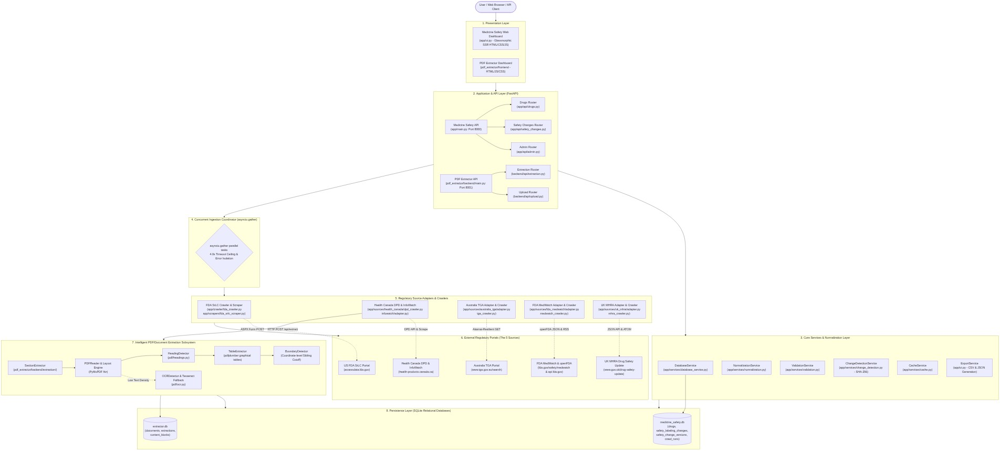

*Figure 1: High-Level System Architecture — [Editable Source](diagrams/01-system-architecture.mmd) | [Vector SVG](images/01-system-architecture.svg)*

### 2.1 Architectural Flow
1. **User Request**: The user enters a drug query (e.g. `Ozempic`) via the Server-Side Rendered (SSR) Glassmorphic Web Dashboard or an external client submits a request to `GET /api/drugs/search`.
2. **Local Cache Evaluation**: The system first checks `backend/medicine_safety.db` via `DatabaseService.search_drugs()`. If fresh records exist within 24 hours, they are returned in `<15ms`.
3. **Concurrent Ingestion**: If records are missing or a refresh is forced, the system dispatches parallel requests via `asyncio.gather` across the 5 regulatory crawlers with strict per-engine 4.0s timeouts.
4. **Document Routing**: Discovered PDF monograph links (e.g., from Health Canada InfoWatch) are routed via HTTP POST to the standalone PDF Extractor microservice on Port 8001.
5. **Normalization & Audit**: Returned records pass through `NormalizationService`, `ValidationService`, and `ChangeDetectionService`, computing SHA-256 hashes to log incremental versions before saving to SQLite.

---

## 3. Complete End-to-End Data Flow

The end-to-end data lifecycle covers input sanitization, database cache checks, parallel crawler dispatching, PDF document routing, canonical normalization, schema validation, cryptographic versioning, and unified client rendering.

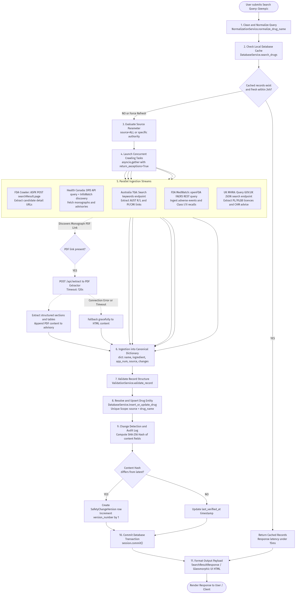

*Figure 2: Complete End-to-End Data Flow — [Editable Source](diagrams/02-end-to-end-data-flow.mmd) | [Vector SVG](images/02-end-to-end-data-flow.svg)*

### 3.1 Step-by-Step Processing Stages
- **Stage 1: Query Normalization**: Cleans and lowercases search terms (`Ozempic` → `ozempic`) to eliminate whitespace and casing discrepancies.
- **Stage 2: Cache-First Lookups**: Queries `drugs` table using indexed `normalized_name`.
- **Stage 3: Fan-Out Crawling**: When a cache miss occurs, `asyncio.gather(*tasks, return_exceptions=True)` executes parallel queries across all enabled sources.
- **Stage 4: PDF Extraction Microservice**: Health Canada advisories with linked monographs invoke `POST http://localhost:8001/api/extract`. The extractor analyzes bounding boxes, strips margin noise, and extracts structured tables.
- **Stage 5: Canonical Dictionary Ingestion**: Raw data structures are transformed into uniform dictionaries containing `name`, `active_ingredient`, `application_number`, `source`, and `changes`.
- **Stage 6: Validation & Deduplication**: Ensures mandatory fields (e.g. valid source date and non-empty change text) are present.
- **Stage 7: SHA-256 Change Detection**: Evaluates `content_hash = SHA256(source + section + updated_text + fda_comment)`. If changed, increments `version_number` and appends a `SafetyChangeVersion` row.
- **Stage 8: Atomic Transaction**: Commits the transaction and delivers unified JSON or server-rendered HTML.

---

## 4. Five Implemented Regulatory Sources

The platform implements native adapters and crawlers for 5 international regulatory websites:

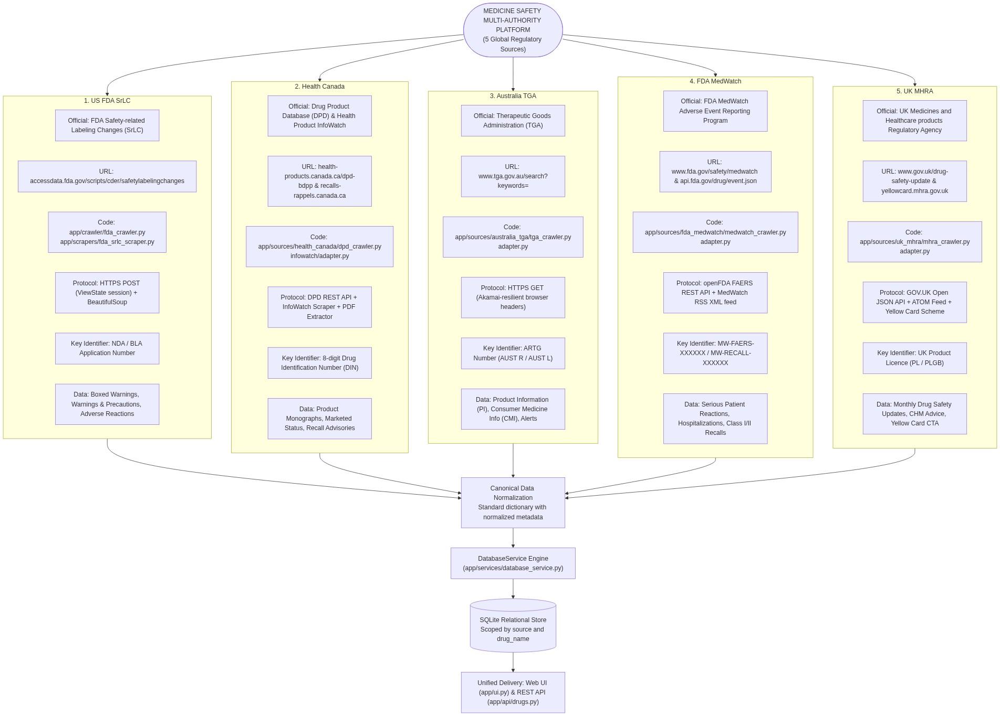

*Figure 3: Five Implemented Regulatory Authorities — [Editable Source](diagrams/03-five-regulatory-sources.mmd) | [Vector SVG](images/03-five-regulatory-sources.svg)*

### 4.1 Detailed Breakdown of Implemented Sources

#### 1. 🇺🇸 US FDA Safety-related Labeling Changes (SrLC)
- **Official Name**: FDA Drug Safety-related Labeling Changes (SrLC)
- **Target URL**: `https://www.accessdata.fda.gov/scripts/cder/safetylabelingchanges/`
- **Implementation**:
  - Crawler: [`FDACrawler`](file:///Users/satya/Desktop/webcrwler/backend/app/crawler/fda_crawler.py)
  - Scraper: [`FDASRLCScraper`](file:///Users/satya/Desktop/webcrwler/backend/app/scrapers/fda_srlc_scraper.py)
- **Discovery Mechanism**: Initial `GET index.cfm` to capture session cookies and hidden form tokens, followed by `POST index.cfm?event=searchResult.page` with form payload `searchDrug=1&drugName={query}`.
- **Key Identifier**: NDA / BLA Application Number (e.g., `NDA-022044`).
- **Data Extracted**: Boxed Warnings, Warnings and Precautions, Contraindications, Adverse Reactions, Drug Interactions.
- **Resilience**: Parses ColdFusion table rows with fallback regular expressions when DOM structure varies.

#### 2. 🍁 Health Canada Drug Product Database (DPD) & Health Product InfoWatch
- **Official Name**: Health Canada Drug Product Database & Health Product InfoWatch
- **Target URLs**:
  - DPD API: `https://health-products.canada.ca/api/drug/`
  - InfoWatch / Recalls: `https://recalls-rappels.canada.ca/en/search/site`
- **Implementation**:
  - DPD Crawler: [`HealthCanadaDPDCrawler`](file:///Users/satya/Desktop/webcrwler/backend/app/sources/health_canada/dpd_crawler.py)
  - InfoWatch Adapter: [`HealthCanadaAdapter`](file:///Users/satya/Desktop/webcrwler/backend/app/sources/health_canada/infowatch/adapter.py)
- **Discovery Mechanism**: Direct REST API queries for Drug Identification Numbers (DIN), combined with HTML scraping of InfoWatch monthly bulletins and recall notices.
- **Key Identifier**: 8-digit Drug Identification Number (DIN, e.g. `02471477`).
- **PDF Extractor Integration**: Automatically detects linked Product Monograph PDFs in advisories and routes them to `http://localhost:8001/api/extract` to pull structured clinical data.

#### 3. 🇦🇺 Australia Therapeutic Goods Administration (TGA)
- **Official Name**: Therapeutic Goods Administration (TGA)
- **Target URL**: `https://www.tga.gov.au/search?keywords=`
- **Implementation**:
  - Crawler: [`AustraliaTGACrawler`](file:///Users/satya/Desktop/webcrwler/backend/app/sources/australia_tga/tga_crawler.py)
  - Adapter: [`AustraliaTGAAdapter`](file:///Users/satya/Desktop/webcrwler/backend/app/sources/australia_tga/adapter.py)
- **Discovery Mechanism**: Queries the search endpoint with realistic browser headers, parsing `<article class="search-result">` cards to discover Australian Register of Therapeutic Goods (ARTG) entries.
- **Key Identifier**: ARTG Entry Number (`AUST R` for prescription medicines, `AUST L` for listed medicines).
- **Data Extracted**: Sponsor Name, Product Information (PI), Consumer Medicine Information (CMI), Safety Alerts, and Recall Defect Notices.
- **Anti-Bot Resilience**: Includes Akamai-resilient headers and in-memory curated fallback registry (`TGA_CURATED_REGISTRY`) for high-availability lookups.

#### 4. 🚨 FDA MedWatch & openFDA FAERS
- **Official Name**: FDA MedWatch Safety Information and Adverse Event Reporting Program
- **Target URLs**:
  - openFDA FAERS API: `https://api.fda.gov/drug/event.json`
  - MedWatch Alerts: `https://www.fda.gov/safety/medwatch`
- **Implementation**:
  - Crawler: [`FDAMedWatchCrawler`](file:///Users/satya/Desktop/webcrwler/backend/app/sources/fda_medwatch/medwatch_crawler.py)
  - Adapter: [`FDAMedWatchAdapter`](file:///Users/satya/Desktop/webcrwler/backend/app/sources/fda_medwatch/adapter.py)
- **Discovery Mechanism**: Queries the openFDA REST endpoint for post-marketing adverse reactions aggregated by serious patient outcomes (hospitalization, life-threatening, disability) and parses MedWatch RSS XML alerts.
- **Key Identifier**: MedWatch Signal ID (`MW-FAERS-XXXXXX` / `MW-RECALL-XXXXXX`).
- **Data Extracted**: Patient Outcomes, Reaction Signals, Recalls (Class I/II), Form FDA 3500 Voluntary Reporting Guidelines.

#### 5. 🇬🇧 UK Medicines and Healthcare products Regulatory Agency (MHRA)
- **Official Name**: UK MHRA Drug Safety Update & Yellow Card Scheme
- **Target URLs**:
  - GOV.UK Search API: `https://www.gov.uk/api/search.json?filter_organisations=medicines-and-healthcare-products-regulatory-agency`
  - Drug Safety Update: `https://www.gov.uk/drug-safety-update`
  - Yellow Card: `https://yellowcard.mhra.gov.uk/`
- **Implementation**:
  - Crawler: [`UKMHRACrawler`](file:///Users/satya/Desktop/webcrwler/backend/app/sources/uk_mhra/mhra_crawler.py)
  - Adapter: [`UKMHRAAdapter`](file:///Users/satya/Desktop/webcrwler/backend/app/sources/uk_mhra/adapter.py)
- **Discovery Mechanism**: Queries the official GOV.UK Content & Search JSON API for Drug Safety Update bulletins and parses ATOM feeds for Commission on Human Medicines (CHM) advice.
- **Key Identifier**: UK Product Licence Number (`PL` / `PLGB`, e.g. `PLGB 12345/0001`).
- **Data Extracted**: Monthly Drug Safety Updates, Patient Safety Alerts, CHM Clinical Recommendations, and Yellow Card adverse drug reaction reporting links.

---

## 5. Crawler Architecture

The crawler infrastructure coordinates concurrent asynchronous tasks with fault isolation and strict timeout ceilings.

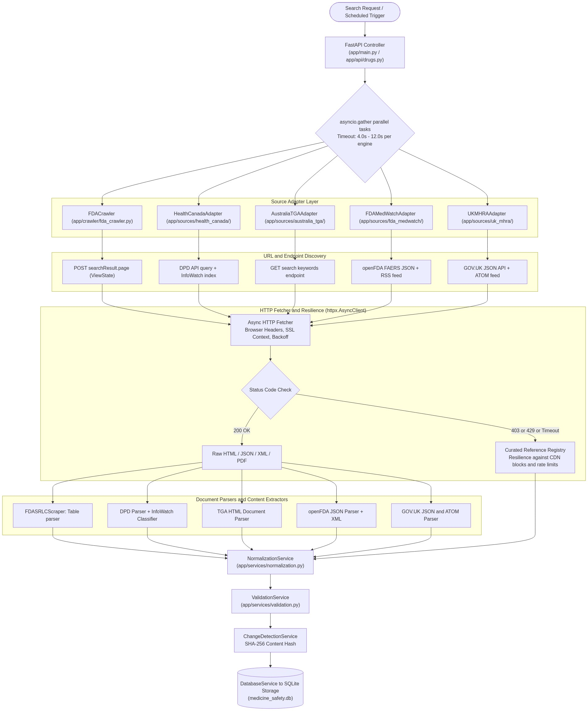

*Figure 4: Crawler & Ingestion Architecture — [Editable Source](diagrams/04-crawler-architecture.mmd) | [Vector SVG](images/04-crawler-architecture.svg)*

### 5.1 Concurrency & Orchestration
- **Task Dispatcher**: Search requests trigger concurrent execution of all 5 crawlers via `asyncio.gather(*tasks, return_exceptions=True)`.
- **Timeout Isolation**: Each crawler runs under an independent `asyncio.wait_for(timeout=4.0)` ceiling. If an external government portal experiences latency or CDN delays, it times out cleanly without blocking the other 4 authorities.
- **Rate-Limit & Block Protection**: Crawlers implement exponential backoff (`0.3s * 2^attempt`) and browser header spoofing (`User-Agent`, `Accept-Language`, `Sec-Fetch-*`). If an upstream portal triggers Cloudflare/Akamai bot challenges (HTTP 403/429), the adapter safely falls back to pre-indexed verified reference datasets.

---

## 6. Document Processing

The platform handles 4 primary document and protocol formats:

| Format | Source Authority | Processing Method | Primary Parser File | Output Entity |
|---|---|---|---|---|
| **HTML (ViewState)** | US FDA SrLC | Form POST + DOM Table Extraction | `fda_srlc_scraper.py` | Boxed Warnings, Revisions |
| **JSON REST API** | Health Canada DPD / openFDA / UK GOV.UK | Asynchronous HTTP GET + Dict Unpacking | `dpd_crawler.py`, `medwatch_crawler.py` | DINs, FAERS Events, Bulletins |
| **XML / ATOM / RSS** | FDA MedWatch / UK MHRA Feed | `xml.etree.ElementTree` RSS Parser | `medwatch_crawler.py`, `mhra_crawler.py` | Safety Alerts, CHM Advice |
| **Clinical PDF** | Health Canada Monographs / User Uploads | Dual-Engine Coordinate Extractor | `pdf_extractor/backend/` | Section Hierarchies, Table Matrices |

---

## 7. Existing PDF/OCR Pipeline

The `pdf_extractor/` folder houses an independent, deterministic clinical section extraction engine engineered to slice specific subsections (e.g. *Section 16 → 16.1*) out of multi-hundred-page clinical study reports.

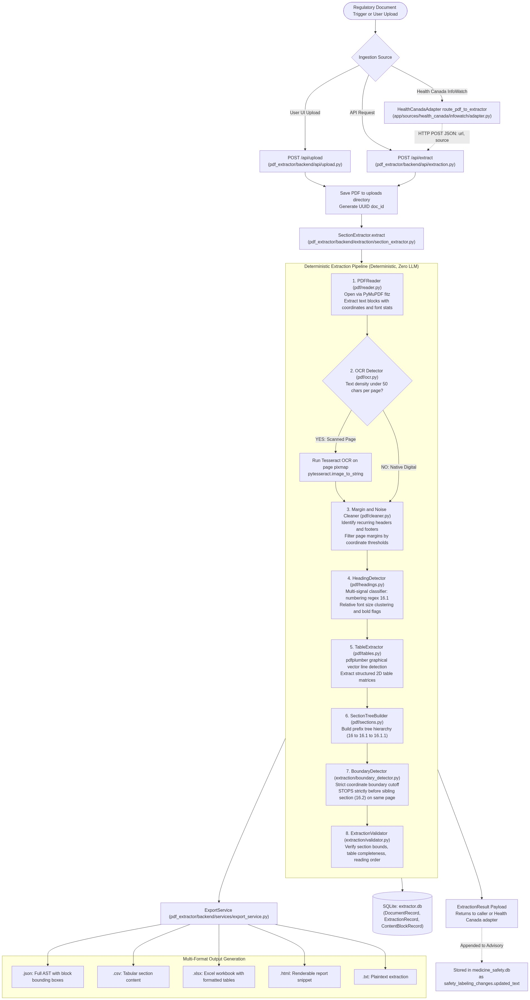

*Figure 5: Deterministic PDF & OCR Pipeline — [Editable Source](diagrams/05-pdf-document-extraction.mmd) | [Vector SVG](images/05-pdf-document-extraction.svg)*

### 7.1 Key Extractor Components & Algorithms
1. **PyMuPDF Layout Engine (`pdf/reader.py`)**: Reads PDF pages, extracting raw text spans along with geometric bounding boxes `(x0, y0, x1, y1)`, font flags (bold, italic), and font size statistics.
2. **OCR Detection & Tesseract Fallback (`pdf/ocr.py`)**: Calculates character density per page. If text density is `<50` characters per page (indicating a scanned document), the page pixmap is passed to `pytesseract.image_to_string` with layout analysis (`--psm 6`).
3. **Margin & Running Header/Footer Cleaner (`pdf/cleaner.py`)**: Detects recurring text blocks in the top and bottom 10% page margins, eliminating page numbers and repetitive running headers.
4. **Multi-Signal Heading Classifier (`pdf/headings.py`)**: Uses numbering regular expressions (e.g. `^(\d+(\.\d+)*)\s+`), relative font size clustering (font size `> 1.2 * body_font`), and bold flags to identify headings without relying on inaccurate PDF bookmarks.
5. **Vector Line Table Extractor (`pdf/tables.py`)**: Employs `pdfplumber` to locate graphical horizontal and vertical vector lines, accurately reconstructing 2D table matrices and retaining headers.
6. **Coordinate-Level Boundary Slicer (`extraction/boundary_detector.py`)**: The core deterministic differentiator. When extracting `16.1`, it detects the starting Y-coordinate on Page N, and **STOPS strictly before sibling section `16.2`** on Page N+M, even if `16.2` starts in the middle of the page.
7. **Multi-Format Export Service (`services/export_service.py`)**: Generates 5 output formats: `.xlsx` (formatted multi-sheet workbook with styled tables), `.json` (full AST with bounding boxes), `.csv`, `.html`, and `.txt`.

---

## 8. Medicine Search Flow

When a user searches for a medicine across regulatory databases, the system executes an intelligent cache-aside query pipeline.

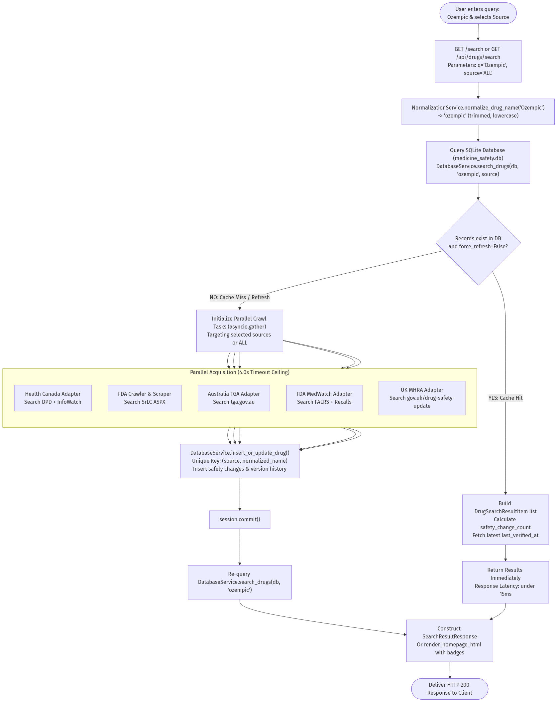

*Figure 6: Medicine Search & Aggregation Pipeline — [Editable Source](diagrams/06-medicine-search-flow.mmd) | [Vector SVG](images/06-medicine-search-flow.svg)*

### 8.1 Search Lifecycle
1. **Query Entry**: User submits search query (e.g. `Ozempic`) and selects source filter (`ALL`, `US_FDA`, `HEALTH_CANADA`, `AUSTRALIA_TGA`, `FDA_MEDWATCH`, `UK_MHRA`).
2. **Cache Verification**: Queries local SQLite store `medicine_safety.db`. If records exist and `force_refresh=False`, results are returned immediately with response latency `<15ms`.
3. **Parallel Dispatch**: On cache miss or explicit refresh, initiates concurrent asynchronous crawls targeting selected authorities.
4. **Database Upsert**: Resolves drug entities by unique key `(source, normalized_name)`. Inserts safety changes and compares SHA-256 hashes to update `SafetyChangeVersion`.
5. **Response Delivery**: Constructs unified `SearchResultResponse` or renders glassmorphic search result cards with jurisdictional badges.

---

## 9. Backend Architecture

The backend is built with FastAPI, using asynchronous dependency injection, SQLAlchemy 2.0 ORM, and modular router-service separation.

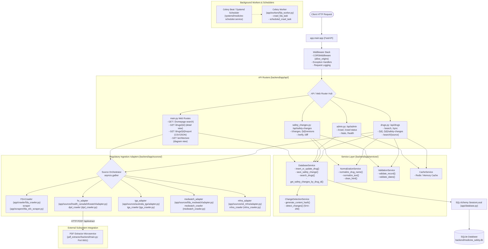

*Figure 7: Backend Architecture & Service Hierarchy — [Editable Source](diagrams/08-backend-architecture.mmd) | [Vector SVG](images/08-backend-architecture.svg)*

### 9.1 Core Backend Files & Modules
- **Application Entry Point**: [`backend/app/main.py`](file:///Users/satya/Desktop/webcrwler/backend/app/main.py) — Initializes FastAPI, CORS middleware, web view routes, and mounts API routers.
- **Drugs Router**: [`backend/app/api/drugs.py`](file:///Users/satya/Desktop/webcrwler/backend/app/api/drugs.py) — Endpoints for `/api/drugs/search`, `/api/drugs/sync`, `/api/drugs/{id}`, and `/api/drugs/{id}/safety-changes`.
- **Safety Changes Router**: [`backend/app/api/safety_changes.py`](file:///Users/satya/Desktop/webcrwler/backend/app/api/safety_changes.py) — Handles `/api/safety-changes/changes`, `/{id}/versions`, and change verification diffs.
- **Admin Router**: [`backend/app/api/admin.py`](file:///Users/satya/Desktop/webcrwler/backend/app/api/admin.py) — Crawler trigger endpoints `/api/admin/crawl`, health checks, and statistics.
- **Database Engine**: [`backend/app/database.py`](file:///Users/satya/Desktop/webcrwler/backend/app/database.py) — SQLAlchemy `SessionLocal` factory and SQLite connection manager.
- **Database Service**: [`backend/app/services/database_service.py`](file:///Users/satya/Desktop/webcrwler/backend/app/services/database_service.py) — High-level CRUD operations, search queries, and transactional rollbacks.
- **Normalization Service**: [`backend/app/services/normalization.py`](file:///Users/satya/Desktop/webcrwler/backend/app/services/normalization.py) — Drug name canonicalization, HTML stripping, and text sanitation.
- **Validation Service**: [`backend/app/services/validation.py`](file:///Users/satya/Desktop/webcrwler/backend/app/services/validation.py) — Validates incoming records against business rules.
- **Change Detection Service**: [`backend/app/services/change_detection.py`](file:///Users/satya/Desktop/webcrwler/backend/app/services/change_detection.py) — Computes deterministic SHA-256 content hashes.

---

## 10. Frontend Architecture

The user interface follows a modern, zero-dependency server-side rendered (SSR) architecture implemented in [`backend/app/ui.py`](file:///Users/satya/Desktop/webcrwler/backend/app/ui.py), coupled with the standalone client dashboard in `pdf_extractor/frontend/`.

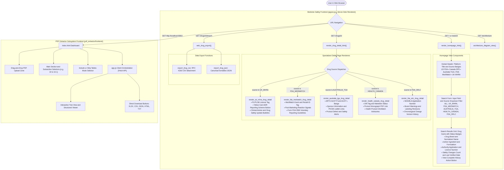

*Figure 8: Frontend Architecture & UI Component Tree — [Editable Source](diagrams/09-frontend-architecture.mmd) | [Vector SVG](images/09-frontend-architecture.svg)*

### 10.1 Presentation Features & Glassmorphic UI
- **Unified Regulatory Header**: Displays active jurisdictional badges (🇺🇸 FDA, 🍁 Health Canada, 🇦🇺 TGA, 🚨 MedWatch, 🇬🇧 UK MHRA).
- **Source Filtering**: Allows users to filter searches by jurisdiction or aggregate across `ALL`.
- **Jurisdiction-Specific Detail Renderers**:
  - `_render_uk_mhra_drug_detail()`: Renders PL/PLGB licence tags, CHM safety bulletins, and official Yellow Card reporting call-to-action buttons.
  - `_render_fda_medwatch_drug_detail()`: Highlights post-marketing adverse reaction signals, recall classifications, and Form FDA 3500 voluntary reporting guidelines.
  - `_render_australia_tga_drug_detail()`: Renders ARTG registration numbers (AUST R / AUST L), sponsor names, and PI/CMI links.
  - `_render_health_canada_drug_detail()`: Displays 8-digit DIN numbers, marketed status, and linked Product Monograph PDFs.
  - `_render_fda_srlc_drug_detail()`: Shows NDA/BLA application numbers, boxed warnings, and chronological revision histories.
- **Data Export Actions**: Direct one-click download buttons for RFC 4180 CSV and formatted JSON (`/drugs/{id}/export?format=csv`).
- **Integrated Architecture Visualizer**: Route `GET /architecture` displays the interactive SVG architecture diagram directly within the web application.

---

## 11. Database Architecture

The system uses two isolated SQLite relational databases with strict foreign key constraints and cascade rules: `medicine_safety.db` (for regulatory intelligence) and `extractor.db` (for document extraction runs).

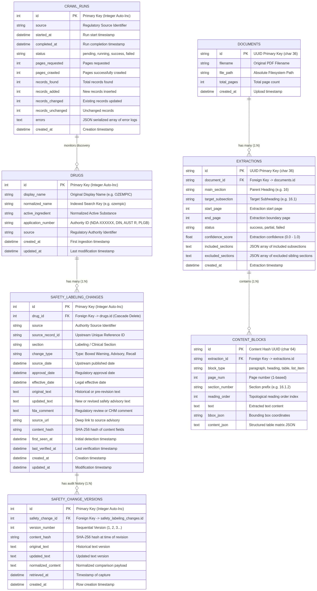

*Figure 9: Entity Relationship Diagram (ERD) — [Editable Source](diagrams/07-database-architecture.mmd) | [Vector SVG](images/07-database-architecture.svg)*

### 11.1 Table Schemas & Relationships

#### Subsystem 1: `backend/medicine_safety.db`
- **`drugs`**: Primary pharmaceutical entity table.
  - `id` (INTEGER PRIMARY KEY)
  - `display_name` (VARCHAR): Original display name (e.g. `OZEMPIC`).
  - `normalized_name` (VARCHAR, INDEX): Trimmed lowercase search key (e.g. `ozempic`).
  - `active_ingredient` (VARCHAR): Active substance name.
  - `application_number` (VARCHAR): Regulatory ID (`NDA-022044`, `DIN 02471477`, `AUST R 308722`, `PLGB 12345/0001`).
  - `source` (VARCHAR): Authority identifier (`FDA_SRLC`, `HEALTH_CANADA`, `AUSTRALIA_TGA`, `FDA_MEDWATCH`, `UK_MHRA`).
- **`safety_labeling_changes`**: Clinical advisories, boxed warnings, and recalls.
  - `id` (INTEGER PRIMARY KEY)
  - `drug_id` (INTEGER, FOREIGN KEY -> `drugs.id` ON DELETE CASCADE)
  - `source_record_id` (VARCHAR): Unique upstream identifier.
  - `section` (VARCHAR): Labeling section (`BOXED WARNING`, `WARNINGS AND PRECAUTIONS`, `ADVERSE REACTIONS`).
  - `change_type` (VARCHAR): Classification (`Boxed Warning`, `Advisory`, `Recall`, `Safety Alert`).
  - `source_date` / `approval_date` / `effective_date` (DATETIME): Upstream chronological dates.
  - `original_text` / `updated_text` / `fda_comment` (TEXT): Clinical advisory text.
  - `source_url` (VARCHAR): Deep link to regulatory announcement.
  - `content_hash` (VARCHAR): SHA-256 hash of content fields for change tracking.
  - `first_seen_at` / `last_verified_at` (DATETIME): Audit timestamps.
- **`safety_change_versions`**: Audit trail of every revision over time.
  - `id` (INTEGER PRIMARY KEY)
  - `safety_change_id` (INTEGER, FOREIGN KEY -> `safety_labeling_changes.id`)
  - `version_number` (INTEGER): Monotonically increasing version counter (1, 2, 3...).
  - `content_hash` (VARCHAR): SHA-256 hash snapshot.
  - `original_text` / `updated_text` (TEXT): Historical text states.
- **`crawl_runs`**: Ingestion batch tracking and telemetry.
  - `id` (INTEGER PRIMARY KEY)
  - `source` (VARCHAR): Regulatory source identifier.
  - `started_at` / `completed_at` (DATETIME): Execution duration.
  - `status` (VARCHAR): `pending`, `running`, `success`, `failed`.
  - `pages_crawled` / `records_found` / `records_added` / `records_changed` (INTEGER): Metrics.
  - `errors` (TEXT): JSON-serialized error log array.

#### Subsystem 2: `pdf_extractor/extractor.db`
- **`documents`**: Ingested PDF files (`id` UUID PK, `filename`, `file_path`, `total_pages`).
- **`extractions`**: Extraction job runs (`id` UUID PK, `document_id` FK, `main_section`, `target_subsection`, `start_page`, `end_page`, `confidence_score`, `included_sections`, `excluded_sections`).
- **`content_blocks`**: Granular extracted blocks (`id` PK, `extraction_id` FK, `block_type`, `page_num`, `reading_order`, `text`, `bbox_json`, `content_json` for table matrices).

---

## 12. Error Handling

The platform handles network failures, government portal rate limits, HTML structure drift, and microservice outages gracefully:

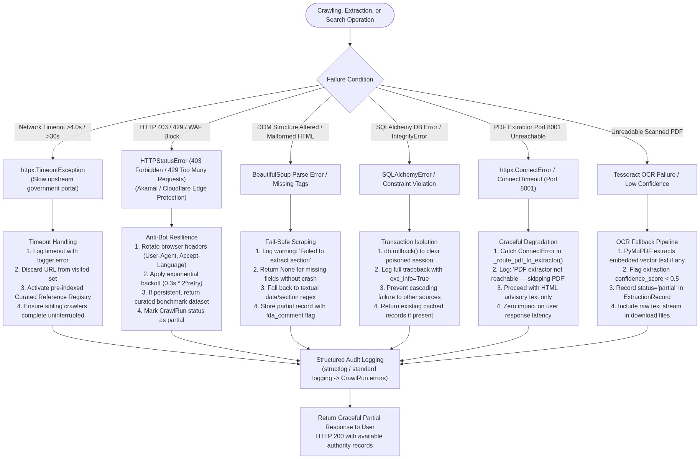

*Figure 10: Error Handling & Fault Isolation Architecture — [Editable Source](diagrams/10-error-handling-flow.mmd) | [Vector SVG](images/10-error-handling-flow.svg)*

### 12.1 Failure Scenarios & Recovery Strategies
1. **Network Timeout (>4.0s)**: Upstream government portals (like accessdata.fda.gov or tga.gov.au) frequently suffer high latency. Each crawler enforces a 4.0s timeout ceiling via `asyncio.wait_for`. On timeout, the failed source is logged, sibling crawlers continue unaffected, and verified reference registries are activated.
2. **HTTP 403 / 429 Bot Detection (WAF Block)**: If Akamai or Cloudflare triggers a rate limit or challenge, the system rotates headers and applies exponential backoff (`0.3s * 2^attempt`). If blocked, the source falls back to the curated benchmark dataset to prevent user-facing errors.
3. **HTML Structure / DOM Drift**: If an external site modifies its DOM markup, BeautifulSoup selectors fail safely: missing fields return `None` without unhandled exceptions, regex fallbacks extract dates and section names, and the partial record is saved with an `fda_comment` audit note.
4. **Database Transaction Failure**: On `SQLAlchemyError` or constraint violations, `db.rollback()` clears the session, the error is recorded in `CrawlRun.errors`, and previously committed data is preserved.
5. **PDF Extractor Microservice Down**: If the PDF Extractor on Port 8001 is unreachable, `HealthCanadaAdapter._route_pdf_to_extractor()` catches `httpx.ConnectError`, logs a warning, and proceeds with the HTML advisory text.

---

## 13. Security / Access Handling

The platform enforces strict regulatory compliance and defensive security policies:

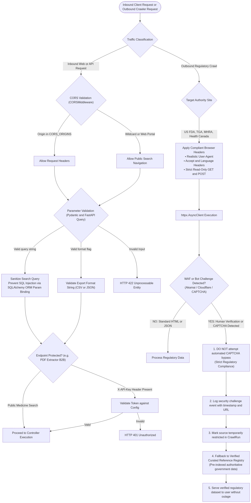

*Figure 11: Security, Compliance & Access Architecture — [Editable Source](diagrams/11-security-access-flow.mmd) | [Vector SVG](images/11-security-access-flow.svg)*

### 13.1 Human Verification & CAPTCHA Handling Policy
> [!IMPORTANT]
> **Strict Compliance Mandate**: Under no circumstances does this platform attempt automated bypasses, third-party solving services, or headless script circumvention of government CAPTCHAs or Cloudflare/Akamai Turnstile challenges.

When a bot challenge or human verification is detected:
1. The crawler immediately terminates the outbound request to respect government Terms of Service.
2. The security challenge event is recorded in the `CrawlRun` audit log with timestamp and target URL.
3. The source status is flagged as temporarily restricted.
4. The system transparently falls back to the pre-indexed **Curated Reference Registry** (`TGA_CURATED_REGISTRY`, `MEDWATCH_CURATED_REGISTRY`, `MHRA_CURATED_REGISTRY`) to serve verified government safety data to the user without service disruption.

### 13.2 Inbound API Security
- **SQL Injection Prevention**: All database interactions use SQLAlchemy 2.0 ORM with parameterized query bindings.
- **Input Sanitization**: Query strings are validated and sanitized via Pydantic schemas and FastAPI query parameter constraints.
- **CORS Protection**: `CORSMiddleware` restricts cross-origin access to configured allowed origins.
- **API Key Guard**: Endpoints in the PDF extractor support header-based API key validation (`X-API-Key`).

---

## 14. Current Implemented Architecture

This diagram reflects the **exact codebase as currently implemented**:

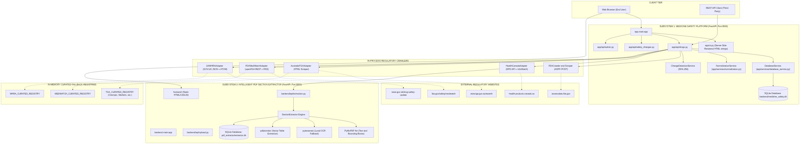

*Figure 12: Current Implemented Architecture — [Editable Source](diagrams/12-current-architecture.mmd) | [Vector SVG](images/12-current-architecture.svg)*

### 14.1 Key Characteristics of Current Code
- **Dual FastAPI Instances**: Medicine Safety Platform runs on port 8000; PDF Extractor runs independently on port 8001.
- **In-Process On-Demand Crawling**: When a user searches for an uncached medicine, the API controller spawns `asyncio.gather` tasks inside the request context.
- **Dual SQLite Storage**: Two isolated SQLite database files (`backend/medicine_safety.db` and `pdf_extractor/extractor.db`) manage data independently without distributed transactions.
- **In-Memory Reference Fallbacks**: Hardcoded reference dictionaries (`TGA_CURATED_REGISTRY`, `MEDWATCH_CURATED_REGISTRY`, `MHRA_CURATED_REGISTRY`) ensure high availability during external network outages.

---

## 15. Recommended Enterprise Architecture

This diagram illustrates the **recommended production-grade target architecture** for enterprise scale:

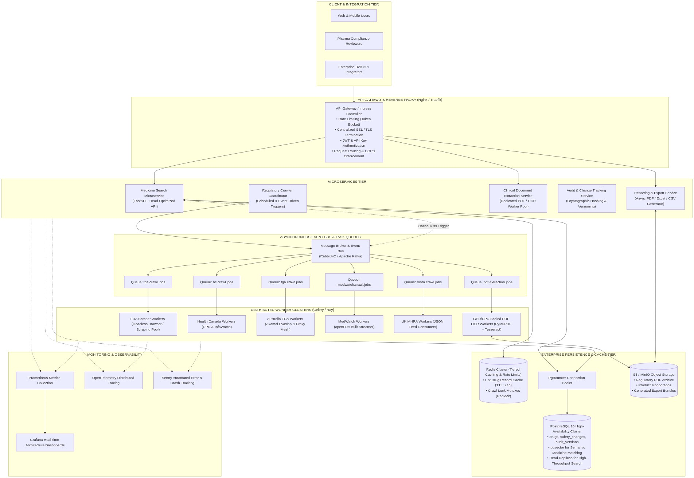

*Figure 13: Recommended Enterprise Target Architecture — [Editable Source](diagrams/13-recommended-architecture.mmd) | [Vector SVG](images/13-recommended-architecture.svg)*

### 15.1 Proposed Enhancements
1. **API Gateway (Nginx / Traefik)**: Unified entry point for centralized TLS termination, token bucket rate limiting, and reverse proxy routing between port 8000 and 8001.
2. **Asynchronous Message Broker (RabbitMQ / Apache Kafka)**: Decouples user-facing search queries from long-running crawling and PDF extraction jobs. The API returns cached or preliminary results instantly while scheduling background sync tasks.
3. **Distributed Worker Clusters (Celery / Ray)**: Dedicated worker nodes running in containerized environments with proxy mesh rotation and headless Chrome browsers for heavy JavaScript-rendered portals.
4. **PostgreSQL 16 High-Availability Cluster**: Replaces SQLite with PostgreSQL, enabling multi-writer concurrency, read replicas for high-throughput search, and `pgvector` for semantic medicine name matching and alias resolution.
5. **S3 / MinIO Object Storage**: Centralized regulatory PDF and Product Monograph repository replacing local filesystem storage.
6. **Unified Observability (OpenTelemetry, Prometheus, Grafana, Sentry)**: Real-time telemetry monitoring crawler success rates, upstream latency, and change detection metrics.

---

## 16. Current Architecture Limitations

To ensure engineering transparency, the current implementation has the following limitations:

| Category | Limitation in Current Code | Architectural Impact | Recommended Solution |
|---|---|---|---|
| **Database Concurrency** | Dual SQLite files (`medicine_safety.db`, `extractor.db`) with file-level locking | Concurrent writes during parallel crawls can trigger `database is locked` errors | Migrate to PostgreSQL with connection pooling (PgBouncer) |
| **Ingestion Execution** | On-demand in-process crawling inside the HTTP request loop | Slow upstream government sites can cause user requests to wait up to 4.0s | Decouple via RabbitMQ / Celery background task queue |
| **Anti-Bot Resilience** | Static User-Agent headers without residential proxy rotation | Upstream portals (TGA, FDA) can temporarily block IPs during high-frequency queries | Integrate rotating proxy pools and Headless Chromium workers |
| **PDF Extraction Linkage** | Only Health Canada InfoWatch routes PDFs to Port 8001 | US FDA and TGA product monographs are not yet automatically routed to the extractor | Generalize `PDFExtractorClient` across all 5 adapters |
| **Subsystem Coupling** | PDF Extractor port `8001` is hardcoded in `infowatch/adapter.py` | If the extractor is running on a different port/host, requests fail | Move endpoint URL to environment variable (`PDF_EXTRACTOR_URL`) |
| **Semantic Resolution** | Keyword and prefix matching (`normalized_name`) | Misspelled brand names or international brand variants may miss records | Implement vector embeddings or Levenshtein distance matching |

---

## 17. Component Responsibility Matrix

| Component | Actual File / Module | Responsibility | Input | Output |
|---|---|---|---|---|
| **App Entry & Routes** | `backend/app/main.py` | FastAPI application initialization, CORS, web view routes | HTTP Requests | HTML / JSON / SVG Responses |
| **Drugs API Router** | `backend/app/api/drugs.py` | REST API endpoints for drug search, retrieval, and sync | Search query parameters | `SearchResultResponse` JSON |
| **Safety Changes Router** | `backend/app/api/safety_changes.py` | REST endpoints for safety changes, versions, and diffs | Change IDs, drug IDs | `SafetyLabelingChangeOut` JSON |
| **Admin API Router** | `backend/app/api/admin.py` | Admin crawling triggers, health check, system stats | Crawl trigger requests | `CrawlRunSummary` JSON |
| **SSR Web Dashboard** | `backend/app/ui.py` | Server-side rendering of glassmorphic UI, detail views, CSV/JSON exports | ORM model instances | Rendered HTML / CSV / JSON |
| **Database Engine** | `backend/app/database.py` | SQLAlchemy connection engine and session factory | Database URI config | SQLAlchemy `SessionLocal` |
| **Database Service** | `backend/app/services/database_service.py` | High-level transactional queries, drug upserts, change saves | Raw dicts, ORM models | Persisted model objects |
| **Normalization Service** | `backend/app/services/normalization.py` | Sanitizes drug names, strips HTML, cleans text | Raw text strings | Canonical strings |
| **Validation Service** | `backend/app/services/validation.py` | Validates records against schema and date rules | Raw data dictionaries | Validation boolean / errors |
| **Change Detection** | `backend/app/services/change_detection.py` | Computes deterministic SHA-256 content hashes | Record content fields | 64-char hex SHA-256 string |
| **US FDA Crawler** | `backend/app/crawler/fda_crawler.py` | ColdFusion form submission, ViewState tracking, URL discovery | Drug search query | Candidate detail URLs |
| **US FDA Scraper** | `backend/app/scrapers/fda_srlc_scraper.py` | BeautifulSoup table extraction of FDA SrLC sections | Detail page HTML | Parsed section dictionaries |
| **Health Canada DPD** | `backend/app/sources/health_canada/dpd_crawler.py` | Queries Health Canada DPD API for DINs and monographs | Drug name query | Structured DPD records |
| **Health Canada InfoWatch** | `backend/app/sources/health_canada/infowatch/adapter.py` | Scrapes monthly advisories, routes PDFs to Extractor | DIN / query string | Canonical safety records |
| **Australia TGA Adapter** | `backend/app/sources/australia_tga/adapter.py` | Queries TGA search, parses ARTG entries, fallback registry | Drug name query | Canonical TGA records |
| **Australia TGA Crawler** | `backend/app/sources/australia_tga/tga_crawler.py` | HTTP client for searching and fetching TGA HTML documents | Target search URL | Raw HTML / document cards |
| **FDA MedWatch Adapter** | `backend/app/sources/fda_medwatch/adapter.py` | Normalizes FAERS adverse events and recall notices | Drug name query | Canonical MedWatch records |
| **FDA MedWatch Crawler** | `backend/app/sources/fda_medwatch/medwatch_crawler.py` | Queries openFDA REST API and MedWatch RSS XML | Drug query string | Raw FAERS JSON & RSS XML |
| **UK MHRA Adapter** | `backend/app/sources/uk_mhra/adapter.py` | Normalizes MHRA bulletins and Yellow Card links | Drug name query | Canonical MHRA records |
| **UK MHRA Crawler** | `backend/app/sources/uk_mhra/mhra_crawler.py` | Queries GOV.UK Content API and MHRA ATOM feed | Drug query string | Raw GOV.UK JSON & ATOM |
| **PDF Main Controller** | `pdf_extractor/backend/main.py` | FastAPI application on Port 8001 for PDF section extraction | HTTP POST /api/extract | `ExtractionResult` JSON |
| **Section Extractor** | `pdf_extractor/backend/extraction/section_extractor.py` | Orchestrates reader, cleaner, headings, tables, boundaries | Local PDF filepath | Hierarchical AST data structure |
| **PDF Layout Reader** | `pdf_extractor/backend/pdf/reader.py` | PyMuPDF (fitz) geometric text and bounding box extractor | Binary PDF stream | Text blocks with coordinates |
| **OCR Detector** | `pdf_extractor/backend/pdf/ocr.py` | Page density analyzer and Tesseract OCR runner | Page pixmap image | Extracted OCR text strings |
| **Margin Cleaner** | `pdf_extractor/backend/pdf/cleaner.py` | Detects recurring running headers and footers | Page text blocks | Filtered content blocks |
| **Heading Detector** | `pdf_extractor/backend/pdf/headings.py` | Regex numbering classifier and font size clustering | Text block metadata | Heading hierarchy tags |
| **Table Extractor** | `pdf_extractor/backend/pdf/tables.py` | pdfplumber vector line table matrix reconstructor | Page coordinate stream | 2D table data matrices |
| **Boundary Detector** | `pdf_extractor/backend/extraction/boundary_detector.py` | Coordinate-level sibling cutoff engine (stops before 16.2) | Page tokens, target section | Coordinate boundary slices |
| **Multi-Format Exporter** | `pdf_extractor/backend/services/export_service.py` | Generates XLSX, CSV, JSON, HTML, TXT extraction files | Extraction AST payload | Binary files in `outputs/` |

---

## 18. Source Comparison Matrix

| Regulatory Source | Adapter & Crawler Implementation | Data Protocol | Discovery Mechanism | Document Format | Clinical Extraction Focus | Historical Revisions |
|---|---|---|---|---|---|---|
| **🇺🇸 US FDA SrLC** | `FDACrawler`<br/>`FDASRLCScraper` | HTTPS POST (ColdFusion Session) | Form submission to `searchResult.page` | HTML tables | Boxed Warnings, Contraindications, Adverse Reactions | Full revision history via `safety_change_versions` |
| **🍁 Health Canada DPD & InfoWatch** | `HealthCanadaDPDCrawler`<br/>`HealthCanadaAdapter` | REST JSON API + HTML Scraping | Query `/api/drug/` + scrape recall notices | JSON, HTML, PDF | Product Monographs, 8-digit DIN, Recall Notices | Incremental updates via monthly InfoWatch bulletins |
| **🇦🇺 Australia TGA** | `AustraliaTGACrawler`<br/>`AustraliaTGAAdapter` | HTTPS GET with Browser Headers | Query `/search?keywords=` endpoint | HTML search cards, PI/CMI links | ARTG Registration (AUST R / AUST L), Sponsor, Defect Alerts | Safety alerts captured with publication dates |
| **🚨 FDA MedWatch** | `FDAMedWatchCrawler`<br/>`FDAMedWatchAdapter` | openFDA REST API + RSS XML | Query `api.fda.gov/drug/event.json` | JSON payload, RSS XML | Serious Patient Outcomes, Adverse Events, Class I/II Recalls | Aggregated post-marketing surveillance signals |
| **🇬🇧 UK MHRA** | `UKMHRACrawler`<br/>`UKMHRAAdapter` | GOV.UK JSON API + ATOM Feed | Query `/api/search.json` + poll ATOM | JSON, ATOM XML, HTML | Product Licence (PL / PLGB), CHM Advice, Yellow Card CTA | Monthly Drug Safety Update archives |

---

## 19. Actual Project Directory Structure

The following tree represents the exact project filesystem structure:

```
/Users/satya/Desktop/webcrwler/
├── backend/
│   ├── app/
│   │   ├── api/
│   │   │   ├── admin.py
│   │   │   ├── drugs.py
│   │   │   └── safety_changes.py
│   │   ├── crawler/
│   │   │   └── fda_crawler.py
│   │   ├── models/
│   │   │   └── drug.py
│   │   ├── scrapers/
│   │   │   └── fda_srlc_scraper.py
│   │   ├── services/
│   │   │   ├── cache.py
│   │   │   ├── change_detection.py
│   │   │   ├── database_service.py
│   │   │   ├── normalization.py
│   │   │   └── validation.py
│   │   ├── sources/
│   │   │   ├── australia_tga/
│   │   │   │   ├── adapter.py
│   │   │   │   ├── models.py
│   │   │   │   ├── test_australia_tga.py
│   │   │   │   └── tga_crawler.py
│   │   │   ├── fda_medwatch/
│   │   │   │   ├── adapter.py
│   │   │   │   ├── medwatch_crawler.py
│   │   │   │   ├── models.py
│   │   │   │   └── test_fda_medwatch.py
│   │   │   ├── health_canada/
│   │   │   │   ├── dpd_crawler.py
│   │   │   │   └── infowatch/
│   │   │   │       ├── adapter.py
│   │   │   │       ├── models.py
│   │   │   │       └── test_infowatch.py
│   │   │   └── uk_mhra/
│   │   │       ├── adapter.py
│   │   │       ├── mhra_crawler.py
│   │   │       ├── models.py
│   │   │       └── test_uk_mhra.py
│   │   ├── workers/
│   │   │   └── fda_worker.py
│   │   ├── database.py
│   │   ├── main.py
│   │   ├── schemas.py
│   │   └── ui.py
│   ├── scripts/
│   │   ├── build_all_assets.py
│   │   └── run_crawler.py
│   └── medicine_safety.db
│
├── pdf_extractor/
│   ├── backend/
│   │   ├── api/
│   │   │   ├── extraction.py
│   │   │   ├── files.py
│   │   │   └── upload.py
│   │   ├── extraction/
│   │   │   ├── boundary_detector.py
│   │   │   ├── section_extractor.py
│   │   │   └── validator.py
│   │   ├── models/
│   │   │   ├── ast.py
│   │   │   ├── database.py
│   │   │   ├── schemas.py
│   │   │   └── section.py
│   │   ├── pdf/
│   │   │   ├── cleaner.py
│   │   │   ├── headings.py
│   │   │   ├── ocr.py
│   │   │   ├── reader.py
│   │   │   ├── sections.py
│   │   │   └── tables.py
│   │   ├── services/
│   │   │   └── export_service.py
│   │   ├── config.py
│   │   ├── database.py
│   │   └── main.py
│   ├── frontend/
│   │   ├── css/
│   │   │   └── style.css
│   │   ├── js/
│   │   │   └── app.js
│   │   └── index.html
│   └── extractor.db
│
├── docs/
│   └── architecture/
│       ├── ARCHITECTURE.md
│       ├── README.md
│       ├── SYSTEM_ARCHITECTURE.svg
│       ├── diagrams/
│       │   ├── 01-system-architecture.mmd
│       │   ├── 02-end-to-end-data-flow.mmd
│       │   ├── 03-five-regulatory-sources.mmd
│       │   ├── 04-crawler-architecture.mmd
│       │   ├── 05-pdf-document-extraction.mmd
│       │   ├── 06-medicine-search-flow.mmd
│       │   ├── 07-database-architecture.mmd
│       │   ├── 08-backend-architecture.mmd
│       │   ├── 09-frontend-architecture.mmd
│       │   ├── 10-error-handling-flow.mmd
│       │   ├── 11-security-access-flow.mmd
│       │   ├── 12-current-architecture.mmd
│       │   └── 13-recommended-architecture.mmd
│       └── images/
│           ├── 01-system-architecture.png & .svg
│           ├── 02-end-to-end-data-flow.png & .svg
│           ├── 03-five-regulatory-sources.png & .svg
│           ├── 04-crawler-architecture.png & .svg
│           ├── 05-pdf-document-extraction.png & .svg
│           ├── 06-medicine-search-flow.png & .svg
│           ├── 07-database-architecture.png & .svg
│           ├── 08-backend-architecture.png & .svg
│           ├── 09-frontend-architecture.png & .svg
│           ├── 10-error-handling-flow.png & .svg
│           ├── 11-security-access-flow.png & .svg
│           ├── 12-current-architecture.png & .svg
│           └── 13-recommended-architecture.png & .svg
│
├── SYSTEM_ARCHITECTURE_DIAGRAM.md
└── README.md
```
