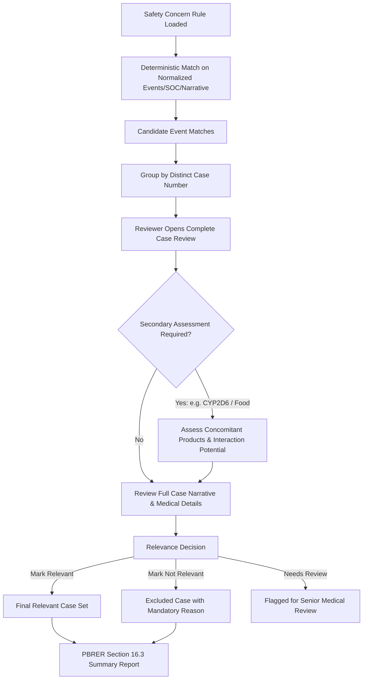

# ACTUAL BUSINESS PROCESS SPECIFICATION
## Pharmacovigilance Safety Concern Evaluation, Line-Listing Transformation, and PBRER Section 16.3 Automation

**Project:** Excel Calculus / Next-Gen PV Safety Concern Evaluation Platform  
**Target Root:** `/Users/satya/projects/webcrwler/excel_calculus`  
**Authors:** Lead Software Engineer, Data Engineer, Product Engineer, and Business-Process Analyst  
**Document Version:** 1.0 (Empirically Verified Against Real Recordings and Domain Datasets)  
**Date:** October 2026  

---

## 1. Business Objective

The business objective is to automate the manual, spreadsheet-intensive, error-prone workflow that Pharmacovigilance (PV) and Periodic Benefit-Risk Evaluation Report (PBRER / PSUR) authoring teams currently execute for aggregate safety reporting (specifically Section 16.3: *Signal and Risk Evaluation — Evaluation of Risks* and Section 9: *Information on Adverse Reactions and Medication Errors*).

In pharmaceutical safety operations (specifically demonstrated by Apotex Inc. and Nextrove):
1. Safety reviewers receive line listings exported from safety databases (e.g., Argus Safety / ArisG) containing hundreds or thousands of adverse event reports.
2. A single patient case often contains **multiple adverse events** packed inside one cell (`Event Verbatim`).
3. For each predefined **Safety Concern** (e.g., Hepatotoxicity, Cardiac Disorders, Osteoporosis, Rhabdomyolysis, Medication Errors, CYP2D6 Drug Interactions, Off-Label Use):
   - Reviewers must extract, clean, and split all individual events.
   - Compare each normalized event against official medical reference terminology (MedDRA Standardised MedDRA Queries [SMQs], System Organ Classes [SOCs], or specific Preferred Term [PT] lists).
   - Perform lookup operations (`VLOOKUP` / `XLOOKUP`) to identify candidate matching cases.
   - Retrieve and read the full medical case details (narrative, concomitant products, dechallenge, rechallenge, medical history).
   - Conduct **clinical relevance assessment** (Relevant, Not Relevant, Needs Medical Review).
   - Perform **secondary assessments** where criteria require concomitant drug checks (e.g., CYP2D6 inhibitors or food exposure).
   - Generate aggregate case counts and summary tables for inclusion into the regulatory PBRER document.

**What this system is NOT:**
- It is NOT a generic text or keyword search engine.
- It is NOT an LLM black box guessing medical diagnoses.
- It is NOT a simple Excel file viewer.

**What this system IS:**
A deterministic, auditable, high-performance digital automation of the exact human review workflow that preserves 100% of data lineage, provides complete case review context, and exports audit-ready PBRER safety outputs.

---

## 2. Main Apotex Workflow (Priority 1 Reference)

**Source Reference:** `Apotex - Progressive Compliance Pending Sections Requirement Discussion-20260922_183440-Meeting Recording.mp4` (Duration: 50m 28s).  
**Key Participants:** Gargi Athavale, Indraprakash Yadav, Nilima Chaudhari, Keshav P., Reshma, Nisha, Nisarg, Tharun.

### Workflow Sequence Observed in the Apotex Meeting:
1. **Kickoff & Scope Definition:**
   - The team aligns on the regulatory deliverable: Canadian, Kuwait, Oman, and UAE PBRER for **Abiraterone** (reporting period: 29-Apr-2025 to 28-Apr-2026, Data Lock Point [DLP]: 28-Apr-2026).
   - The review specifically addresses Section 16.3 (*Evaluation of Risks* — Important Identified Risks, Important Potential Risks, and Missing Information) and Section 9 (*Medication Errors*).
2. **Review of Safety Concerns & Search Criteria Document:**
   - The primary input guidance document (`Abiraterone CAN PBRER_DLP_20260428_Safety concerns and search criteria_v0.4_Final.docx`) defines the exact safety issues and medical search rules agreed with regulatory authorities (Health Canada, EMA/CMDh, Kuwait MOH, etc.).
3. **Reference Medical Terminology Sourcing:**
   - Reviewers open the official MedDRA reference (`SMQ_spreadsheet_29_0_English.xlsx`).
   - For Broad/Narrow SMQs, reviewers navigate the hierarchical structure, select the designated SMQ (e.g., row 7128: `Drug related hepatic disorders - comprehensive search (SMQ)`), and copy all active Preferred Terms into a working reference sheet (`Sheet1!B:B`).
4. **Line Listing Workbooks:**
   - The team works with both **Interval Line Listings** (`Abiraterone_20260428_CAN-KUW-OMAN-UAE PBRER_Interval Linelisting.xlsx`, 119 cases) and **Cumulative Line Listings** (395 cases total).
5. **Medical Evaluation & PBRER Section Authoring:**
   - Once matching cases are filtered, reviewers review the complete case in the previous signed PBRER (`Abiraterone_20250428_CAN-KUW-UAE-PBRER_Final.pdf`) and the interval case listings.
   - For each safety concern, they compile:
     - Number of initial and follow-up reports received.
     - Serious vs. non-serious breakdown.
     - Fatal outcomes.
     - Distribution of events by Preferred Term (e.g., Table of PT vs Number of Cases).
     - Clinical case summaries (Age, Sex, Indication, Co-suspect/Concomitant drugs, Onset latency, Dechallenge/Rechallenge, Outcome).
     - Apotex / MAH Comment assessing whether a new safety signal is warranted.

---

## 3. Supporting Nilima Workflow (Priority 2 Reference)

**Source Reference:** `Call with Nilima Chaudhari-20260924_214819-Meeting Recording.mp4` (Duration: 10m 30s).  
**Key Participants:** Nilima Chaudhari (demonstrator), Indraprakash Yadav (reviewer).

### Exact Spreadsheet Operations Demonstrated by Nilima:
Nilima demonstrates the exact mechanical transformation required to bridge the raw safety database export and the reference search criteria:

1. **Raw Line Listing Inspection:**
   - The sheet contains columns `Case Number` (Col A) and `Event Verbatim` (Col M).
   - In raw exports, `Event Verbatim` contains multiple bracketed terms with trailing assessment flags and XML control characters (e.g., `[PAIN IN EXTREMITY_x0015__x0016_]_x000D_\nY / Y / Y_x000D_\n[GAIT DISTURBANCE_x0016_]...`).
2. **Importing into Power Query Editor:**
   - Nilima selects the line-listing range and clicks **Data -> From Table/Range** to load the data into Excel Power Query Editor (`Table2 (4)`).
3. **Adding a Custom Cleaned Column:**
   - Under **Add Column -> Custom Column**, she creates a custom cleaned representation (`Custom`) of the event information.
   - Formatting noise, bracket artifacts, and the assessment flags (`Y / Y / Y`, `N / Y / Y`, `N / N / Y`) are stripped.
   - Multiple events are converted into a clean comma-separated string:  
     `PAIN IN EXTREMITY, GAIT DISTURBANCE, BONE PAIN, PROSTATE CANCER, INFLAMMATION, DRY MOUTH, DRY THROAT, COUGH, FATIGUE`.
4. **Splitting Column by Delimiter into Rows (Event Explosion):**
   - In Power Query, she selects the `Custom` column.
   - Clicks **Transform -> Split Column -> By Delimiter**.
   - Selects delimiter: `Comma`.
   - Selects **Split at: Each occurrence of the delimiter**.
   - Expands **Advanced options** and selects **Split into: Rows**!
   - This expands each case row into multiple rows, repeating the `Case Number` for each event:
     - `2025AP002474 | PAIN IN EXTREMITY`
     - `2025AP002474 | GAIT DISTURBANCE`
     - `2025AP002474 | BONE PAIN`
     - ...
   - The result transforms 119 case rows into **225 event rows** (`226 rows loaded` including header in Excel table `Table2_3_2`).
5. **Whitespace Trimming:**
   - In Excel, she creates a helper column: `=TRIM([@Custom])` to eliminate leading/trailing whitespace introduced during delimiter splitting.
6. **Reference Lookup via VLOOKUP:**
   - On another sheet (`Sheet1`), she pastes the reference list of PTs for a specific Safety Concern (e.g., `Sheet1!B:B` containing the PT list for Hepatotoxicity: `Bilirubin excretion disorder`, `Cholestasis`, `Drug-induced liver injury`, etc.).
   - In the event table, she enters:
     ```excel
     =VLOOKUP([@Column1], Sheet1!B:B, 1, FALSE)
     ```
   - Matches return the matched term (or hypothesis name).
   - Non-matches return `#N/A`.
7. **Filtering and Case Identification:**
   - Nilima filters out `#N/A` rows using Excel AutoFilter.
   - The visible rows reveal the **candidate matching cases**.
   - She extracts the distinct `Case Number` list to look up the complete case in the line listing for clinical review.

---

## 4. Source Files & Purpose

| File Name | File Type | Role in Real Process |
| :--- | :--- | :--- |
| `Abiraterone CAN PBRER_DLP_20260428_Safety concerns and search criteria_v0.4_Final.docx` | Word DOCX | **Search Rule / Safety Concern Master:** Defines product, DLP, reporting period, Identified Risks, Potential Risks, Missing Information, search methods (SMQ, SOC, PT list, Manual narrative). |
| `SMQ_spreadsheet_29_0_English.xlsx` | Excel XLSX | **Terminology Reference:** Contains 230 MedDRA Standardised MedDRA Queries (SMQs) with hierarchical parent/child SMQ relationships, Narrow vs Broad scope flags, and Preferred Terms with MedDRA codes. |
| `Abiraterone_20260428_CAN-KUW-OMAN-UAE PBRER_Interval Linelisting.xlsx` | Excel XLSX | **Interval Case Line Listing:** 119 case rows (120 rows incl. header, 26 columns) covering 29-Apr-2025 to 28-Apr-2026. Primary source of case and event data. |
| `Abiraterone_20250428_CAN-KUW-UAE-PBRER_Final.pdf` | PDF (215 pages) | **Previous Signed PBRER:** Template and benchmark for Section 16.3 safety evaluations, previous cumulative case counts, and standard clinical appraisal text. |
| `Abiraterone_20260428_CAN-KUW-OMAN-UAE PBRER_Interval Linelisting.pdf` | PDF | Formatted, signed PDF equivalent of the interval line listing used for regulatory submission. |
| `KOM_Oxycodone_DLP (12-Apr-2026)_CAN-PBRER_Safety concerns and search criteria_Final.docx` | Word DOCX | Second product search criteria: proves generic applicability for Oxycodone (e.g., Off-label use, Accidental exposure, Diversion, Long-term use). |
| `Oxycodone_20260412_CAN PBRER_Interval LL.xlsx` | Excel XLSX | Second product line listing: 48 cases, 51 columns, 723 events (up to 104 events in a single case!). |

---

## 5. Exact Manual Sequence vs. Digital Application Transformation

| Step | Current Manual Human Action | Digital Application Implementation |
| :---: | :--- | :--- |
| **1** | User opens Safety Concerns Word doc and manually reads the search rule for a safety concern. | User selects `Product` + `Reporting Period` + `Safety Concern` from UI; system automatically loads configured criteria. |
| **2** | User opens `SMQ_spreadsheet_29_0_English.xlsx`, expands tree outline, locates SMQ, and copies hundreds of PTs to clipboard. | System stores indexed SMQ database and directly queries the configured SMQ/Scope terms without copy-pasting. |
| **3** | User opens large Line Listing workbook, launches Power Query, creates custom column to clean Event Verbatim. | System automatically parses, cleans (removing XML entities `_x0015_`, `_x0016_`, `_x000D_`, brackets, assessment markers), and normalizes event text on ingestion. |
| **4** | User splits column by comma into rows in Power Query to explode events. | Ingestion engine automatically explodes 1 Case -> N Events while preserving source row, position, and lineage. |
| **5** | User pastes PTs into a helper worksheet (`Sheet1`). | System references pre-indexed medical dictionary tables in database. |
| **6** | User writes `=TRIM([@Custom])` and `=VLOOKUP([@Column1], Sheet1!B:B, 1, FALSE)`. | Deterministic exact/normalized lookup engine executes instant query matching event terms to safety concern rules. |
| **7** | User filters table to exclude `#N/A` values. | System returns only matched events and distinct candidate cases with clear match reason. |
| **8** | User notes down matching Case Numbers, switches back to original line listing, and searches Case Number one by one. | UI provides instant click-through from matching case row to **Complete Case Review Screen** (Patient, Products, Events, Narrative, Assessments). |
| **9** | User reads narrative and decides if case is truly relevant to the safety concern. | Reviewer marks relevance (`Relevant`, `Not Relevant`, `Needs Review`) with reason, notes, user ID, and timestamp. |
| **10** | For CYP2D6 or Food interactions, user manually inspects concomitant medications. | Secondary assessment workflow surfaces concomitant drug roles and guides interaction review. |
| **11** | User manually counts distinct relevant cases and calculates breakdown by PT. | System computes distinct candidate cases, distinct relevant cases, and PT breakdown automatically. |
| **12** | User manually drafts PBRER Section 16.3 summary paragraphs and tables. | System exports audit-ready Safety Concern Report formatted specifically for PBRER Section 16.3. |

---

## 6. Event Verbatim Normalization & Event Explosion Rules

### Source Structure
In the source Excel line listing, column `Event Verbatim` has cells formatted like:
```text
[PAIN IN EXTREMITY_x0015__x0016_]_x000D_
Y / Y / Y_x000D_
[GAIT DISTURBANCE_x0016_]_x000D_
Y / Y / Y_x000D_
[BONE PAIN_x0016_]_x000D_
Y / Y / Y
```

### Transformation Pipeline:
1. **Raw Preservation:** The raw cell string is saved in `raw_source_value` with exact character fidelity.
2. **Entity Stripping:** Remove XML hex artifacts (`_x0015_`, `_x0016_`, `_x000D_`, etc.).
3. **Delimiter / Bracket Detection:**
   - Pattern: Match all text enclosed in `[...]`.
   - The trailing `Y / Y / Y` or `N / Y / Y` lines represent case-level/event-level seriousness, listedness, and causality flags, which are separate clinical metadata and must NOT pollute the medical term.
4. **String Normalization:**
   - Strip leading/trailing brackets `[` and `]`.
   - Replace newlines and tabs with spaces.
   - Collapse duplicate whitespace: `\s+` -> `' '`.
   - Trim leading and trailing whitespace.
   - Convert to uppercase for standard comparison while preserving clean title case for display.
5. **Event Explosion:**
   - Case row is exploded into N discrete `CaseEvent` records.
   - Example Case `2025AP002474` yields 9 distinct event records:
     1. `PAIN IN EXTREMITY`
     2. `GAIT DISTURBANCE`
     3. `BONE PAIN`
     4. `PROSTATE CANCER`
     5. `INFLAMMATION`
     6. `DRY MOUTH`
     7. `DRY THROAT`
     8. `COUGH`
     9. `FATIGUE`
   - Total exploded events for Abiraterone Interval LL: **225 events** (matching Nilima's Power Query result of 226 rows including header).
   - Total exploded events for Oxycodone Interval LL: **723 events** across 48 cases.

---

## 7. Deterministic Safety Concern Search Engine

The system supports all 9 search methods specified in the domain documents:

| Search Method | How It Operates | Example from Abiraterone / Oxycodone |
| :--- | :--- | :--- |
| **1. Broad SMQ** | Matches normalized event term against all PTs assigned Broad or Narrow scope in the specified SMQ. | **Hepatotoxicity:** Broad SMQ `Drug related hepatic disorders - comprehensive search (SMQ)` (334 PTs). Returns 14 matching cases in interval data. |
| **2. Narrow SMQ** | Matches normalized event term against only PTs designated `Narrow` scope in the specified SMQ. | **Rhabdomyolysis/Myopathy:** Narrow SMQ `Rhabdomyolysis/myopathy (SMQ)` (15 PTs). Returns 4 matching cases: `2025AP033463`, `2025AP033546`, `2025AP033980`, `2026AP002072`. |
| **3. SOC Match** | Matches against case or event MedDRA System Organ Class. | **Cardiac Disorders:** SOC `Cardiac disorders`. Identifies cases where primary or secondary events fall under Cardiac disorders (e.g., `2025AP008309`: Atrial fibrillation, `2026AP001943`: Cardiac failure). |
| **4. Single PT** | Matches against a single specific Preferred Term. | **Allergic Alveolitis:** PT `Alveolitis`. Returns 0 cases in interval period. |
| **5. Multiple PTs** | Matches against an explicit list of configured Preferred Terms. | **Cataract:** PTs `Cataract`, `Atopic cataract`, `Cataract nuclear`, `Cataract cortical`, `Toxic cataract`, `Cataract subcapsular`. |
| **6. SMQ + PT Sub-filter** | First matches an SMQ, then further assesses with specific PTs. | **Overdose due to medication error:** Broad SMQ `Medication errors` (221 PTs) further filtered by PTs `Overdose` and `Accidental overdose` (1 case matched: `2025AP003306`). |
| **7. Multi-Level Assessment** | Initial PT match followed by secondary clinical rules (e.g., concomitant product check). | **CYP2D6 Drug Interaction:** Initial PTs (`Drug interaction`, `Potentiating drug interaction`, `Labelled drug-drug interaction issue`, `Labelled drug-drug interaction medication error`), followed by secondary inspection of concomitant medications for CYP2D6 inhibitors. |
| **8. Narrative Search** | Case narrative / comments searched for specific phrases or clinical conditions with evidence highlighting. | **Missing Information (Pre-existing conditions):** Search case narrative for pre-existing moderate/severe hepatic impairment, chronic liver disease, severe renal impairment, or baseline hepatitis. |
| **9. Structured Field Search** | Filters based on structured columns such as `Country`, `Seriousness`, `Listedness`, `Outcome`, or `Duration`. | **Oxycodone Long-Term Use:** Duration > 14 days or narrative evidence of long-term use. |

---

## 8. Case Review and Assessment Workflow

A search match produces a **Candidate Case**, NOT an automatic final relevant case.



### Assessment Status States:
1. `CANDIDATE` (Default on initial search match)
2. `RELEVANT` (Confirmed relevant to the safety concern)
3. `NOT_RELEVANT` (Excluded by reviewer; requires structured reason and notes)
4. `NEEDS_REVIEW` (Escalated to Medical Reviewer or Mentor)

---

## 9. Confirmed Rules vs. Uncertain Rules

### Confirmed Rules (Verified with 100% Certainty)
1. **Event Verbatim Splitting:** `Event Verbatim` contains 1 to N events. Splitting by bracketed terms and normalizing removes `Y/Y/Y` flags and whitespace, precisely recreating Nilima's Power Query step (`225 events` from 119 Abiraterone rows).
2. **SMQ Hierarchy & Scopes:** MedDRA SMQ spreadsheet is hierarchical. `Drug related hepatic disorders - comprehensive search` has Broad scope containing 334 PTs.
3. **Distinct Case Counting:** When a single case has 3 matching events (e.g., Case `2024AP011685` with 3 Medication Error events), the case count for the safety concern is **1**, while event match count is **3**.
4. **Medication Error Benchmark:** In Abiraterone Interval LL, searching Broad SMQ `Medication errors` produces **exactly 14 distinct cases**, matching Table 3 of the official Abiraterone document.
5. **Data Lineage:** Every extracted event must maintain pointers to: `source_file`, `source_sheet`, `source_row`, `case_number`, and `raw_value`.

### Rules Configurable by Design:
1. **Cardiac Disorders Boundary:** Some protocols filter strictly on case-level primary SOC = `Cardiac disorders`, while others scan all exploded events for any event mapping to Cardiac disorders. Both modes are supported via configuration.
2. **CYP2D6 Inhibitor List:** The list of approved CYP2D6 inhibitors (e.g., fluoxetine, paroxetine, bupropion, quinidine, duloxetine) is managed as a configurable drug terminology table.
3. **Missing Information Queries:** Narrative regex rules for hepatic impairment, baseline hepatitis, and severe renal disease are stored as configurable search rules per product.

---

## 10. Audit Trail and Regulatory Compliance

In accordance with GAMP 5 and 21 CFR Part 11 principles for computerized systems in pharmacovigilance:
- **Immutable Raw Ingestion:** Uploaded Excel and PDF workbooks are stored in raw storage and never overwritten.
- **Traceability:** For every result displayed in the UI, the reviewer can click **"Show Source Lineage"** to view:
  - Source File Name
  - Sheet Name
  - Original Row Number
  - Raw Unmodified Cell Value
  - Matched Reference Term & SMQ Code
  - Search Criteria Rule ID
- **Audit Logging:** Every user action (ingestion, rule execution, relevance assessment change, exclusion note) is logged with `user_id`, `timestamp`, `action`, `previous_state`, and `new_state`.
