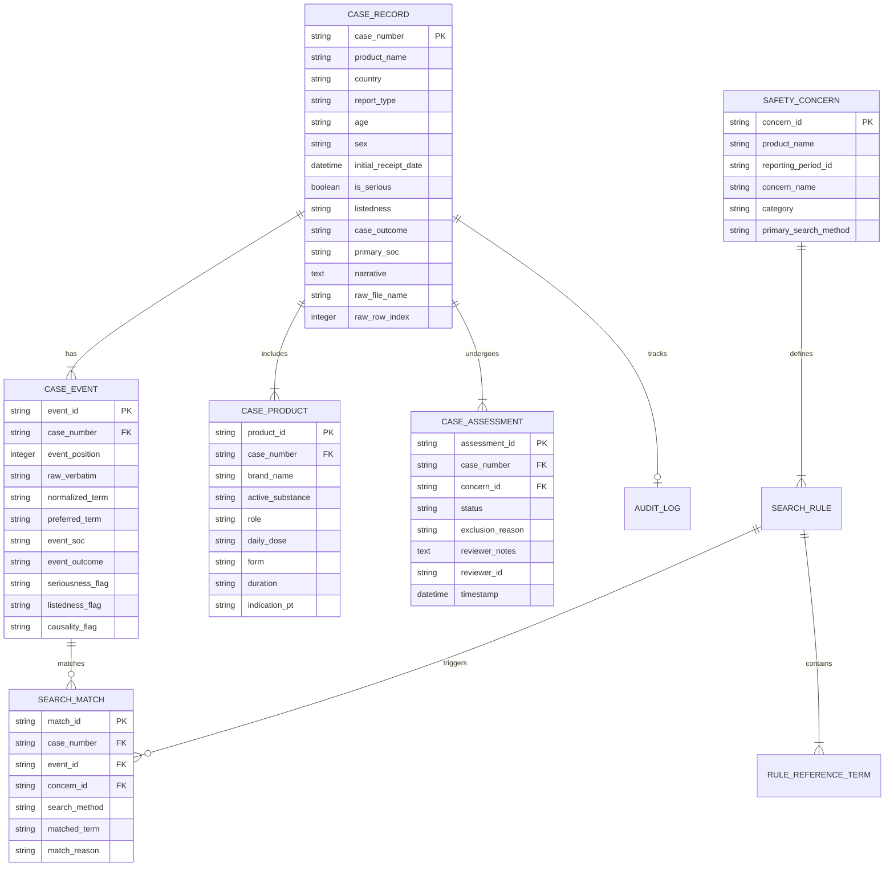

# DATA MAPPING & SCHEMA SPECIFICATION
## Comprehensive Data Architecture for Line Listings, MedDRA Reference Sets, and Safety Concern Configurations

**Project:** Excel Calculus / PV Safety Platform  
**Target Root:** `/Users/satya/projects/webcrwler/excel_calculus`  
**Document Version:** 1.0  
**Status:** Validated Against Real Workbooks (`Abiraterone` & `Oxycodone`)  

---

## 1. Source Workbooks and Sheets Overview

| Source File | Sheet Name | Role | Row Count | Column Count | Distinct Cases |
| :--- | :--- | :--- | :--- | :--- | :--- |
| `Abiraterone_20260428_CAN-KUW-OMAN-UAE PBRER_Interval Linelisting.xlsx` | `1EA46255A95542CBA5AF218A05E670D` | Case / Event Source (Interval) | 119 data rows | 26 cols | 119 cases |
| `Oxycodone_20260412_CAN PBRER_Interval LL.xlsx` | `140BCDC53797405CAD84CD3DE53A356` | Case / Event Source (Interval) | 48 data rows | 30 cols (excl trailing blanks) | 48 cases |
| `SMQ_spreadsheet_29_0_English.xlsx` | `SMQ 29.0` | MedDRA Hierarchical Terminology | 40,000+ rows | 14 indented cols | 230 SMQs |
| `SMQ_spreadsheet_29_0_English.xlsx` | `Active PT Codes` | SMQ-to-PT Code Cross-Reference | 230 rows | 3 cols | 230 SMQs |
| `SMQ_spreadsheet_29_0_English.xlsx` | `SMQ Summary` | SMQ Metadata & Algorithms | 230 rows | 7 cols | 230 SMQs |
| `Abiraterone CAN PBRER_DLP_20260428_Safety concerns and search criteria_v0.4_Final.docx` | Table 4 & Table 3 | Safety Concern & Search Rule Specification | 17 rule rows | 2-3 cols | 10 Safety Concerns |
| `KOM_Oxycodone_DLP (12-Apr-2026)_CAN-PBRER_Safety concerns and search criteria_Final.docx` | Table 4 | Safety Concern & Search Rule Specification | 16 rule rows | 2-3 cols | 11 Safety Concerns |

---

## 2. Line Listing Column Mapping & Classification

Both Abiraterone and Oxycodone share **26 core standard columns**, confirming a unified industry-standard Pharmacovigilance schema:

| Column Name | Data Type | Field Classification | Cardinality in Row | Description / Example Values |
| :--- | :--- | :--- | :--- | :--- |
| `Case Number` | String | **Case Primary Key** | 1 per row | e.g., `2025AP002474`, `2021AP015647`. Canonical cross-entity identifier. |
| `System Organ Class` | String | Case Attribute | 1 per row | MedDRA Primary SOC of the primary event (e.g., `Musculoskeletal and connective tissue disorders`). |
| `Primary Event` | String / Int | Case / Event Flag | 1 per row | Typically `1` indicating the primary reported event. |
| `Previous Submission`| String | Case Attribute | 1 per row | `No` (Interval new) or `Yes` (Cumulative / Previously reported). |
| `Country` | String | Patient / Case Attribute | 1 per row | ISO or standard name (e.g., `CANADA`, `KUWAIT`, `UNITED ARAB EMIRATES`). |
| `Report Type` | String | Regulatory Attribute | 1 per row | `Spontaneous`, `Other` (e.g., Patient Support Program), `Regulatory Authority`. |
| `Age` | String | Patient Demographics | 1 per row | e.g., `77 Years`, `60 Years`, `42 Years`. |
| `Sex` | String | Patient Demographics | 1 per row | `Male`, `Female`, `Unknown`. |
| `Daily Dose` | String | Product Attribute | 1 to N values | e.g., `APO-ABIRATERONE / Film coated tablet`. Multi-product separated by `_x000D_\n`. |
| `Form` | String | Product Attribute | 1 to N values | e.g., `Oral use`, `Transplacental`, `Unknown`. |
| `Duration` | String | Product Exposure | 1 to N values | e.g., `10-NOV-2023 to 01-APR-2025`. |
| `Event Onset` | String | Event Attribute | 1 to N values | e.g., `2025`, `28-Apr-25`, `APR-2025`. Multi-event onset dates. |
| `Event Verbatim` | String | **Raw Multi-Event Composite** | **1 to N Events** | e.g., `[PAIN IN EXTREMITY]\nY/Y/Y\n[GAIT DISTURBANCE]\nY/Y/Y...` Raw uncleaned events with flags. |
| `Outcome` | String | Event Attribute | 1 to N values | e.g., `Fatal`, `Not Recovered/Not Resolved`, `Recovered`, `Unknown`. |
| `Health Care Prof.` | String | Reporter Attribute | 1 per row | `Yes` / `No`. |
| `Non-Serious Listed`| String | Regulatory Classification | 1 per row | `No` / `Yes`. |
| `FollowUp` | String | Case Workflow Flag | 1 per row | `No` (Initial) or `Yes` (Follow-up report). |
| `Case Initial Receipt Date` | Date / String | **Reporting Period Filter** | 1 per row | e.g., `2025-02-20 00:00:00`. Governs interval inclusion. |
| `Case Narrative` | String | Clinical Narrative | 1 per row | Full medical summary describing case history, laboratory data, and course. |
| `Case Seriousness?` | String | Regulatory Classification | 1 per row | `Yes` (Serious) / `No` (Non-serious). |
| `Product Indication PT`| String | Indication Terminology | 1 to N values | MedDRA PT for drug indication (e.g., `Hormone-dependent prostate cancer`). |
| `Product Name` | String | **Multi-Product Composite** | **1 to N Products** | e.g., `PREDNISONE (PREDNISONE) Suspect`, `APO DEXAMETHASONE Concom`. |
| `Case Listedness` | String | Regulatory Classification | 1 per row | `Listed` / `Unlisted`. |
| `Outcome of Event` | String | Event Decomposition Pair | 1 to N pairs | e.g., `Pain in extremity - Unknown\nGait disturbance - Unknown`. |
| `Relevant History Sort Order` | String | Medical History | 1 per row | Pre-existing medical conditions or sort index. |
| `Case Classification` | String | Program Classification | 1 per row | e.g., `Organized Data Collection Program`, `Spontaneous`. |
| *Oxycodone additions:* | | | | |
| `Death Cause` | String | Clinical Outcome | 1 per row | Stated cause of death if fatal. |
| `Product Indication as reported` | String | Verbatim Indication | 1 to N values | Raw reported indication text. |
| `Report Comment` | String | Audit / Processing Note | 1 per row | Reviewer or intake comments. |
| `Case Comment Text` | String | Case Narrative / Audit | 1 per row | Quality or affiliate processing notes. |

---

## 3. Normalized Relational Data Model

To support instantaneous querying, complete case retrieval, and multi-event explosion without re-reading spreadsheets:

---

## 4. MedDRA SMQ Reference Mapping Architecture

In `SMQ_spreadsheet_29_0_English.xlsx`, the sheet `SMQ 29.0` represents hierarchical medical groupings through indented columns:

### Column Alignment by SMQ Depth Level
- **Level 1 (Top SMQ):** Header in Column 1 (`Accidents and injuries (SMQ)`), Scope in Col 2, Status in Col 3, PT Name in Col 4, PT Code in Col 5.
- **Level 2 (Sub-SMQ):** Header in Column 4 (e.g., Col 4 = `Drug related hepatic disorders - comprehensive search (SMQ)`), Scope in Col 4, Status in Col 5, PT Name in Col 6, PT Code in Col 7.
- **Level 3 (Sub-Sub-SMQ):** Header in Column 5 (e.g., Col 5 = `Cholestasis and jaundice of hepatic origin (SMQ)`), terms further indented.

### Verified SMQ Scope Counts:
- **`Drug related hepatic disorders - comprehensive search (SMQ)`:**
  - Broad Scope: **334 distinct Preferred Terms**
  - Narrow Scope: **269 distinct Preferred Terms**
- **`Osteoporosis/osteopenia (SMQ)`:**
  - Broad Scope: **80 distinct Preferred Terms**
  - Narrow Scope: **13 distinct Preferred Terms**
- **`Rhabdomyolysis/myopathy (SMQ)`:**
  - Broad Scope: **60 distinct Preferred Terms**
  - Narrow Scope: **15 distinct Preferred Terms**
- **`Medication errors (SMQ)`:**
  - Broad Scope: **221 distinct Preferred Terms**
  - Narrow Scope: **137 distinct Preferred Terms**

---

## 5. Confirmed Cross-File Relationships & Matching Keys

| Operation | Source 1 | Key / Column | Source 2 | Key / Column | Target Output / Business Rule |
| :--- | :--- | :--- | :--- | :--- | :--- |
| **Event-to-SMQ Lookup** | Normalized Case Event | `normalized_term` (UPPERCASE) | MedDRA SMQ Dictionary | `pt_name` (UPPERCASE) where `smq_name` = Rule SMQ and `scope` IN ('Narrow', 'Broad') | Deterministic Candidate Match |
| **Event-to-PT Lookup** | Normalized Case Event | `normalized_term` (UPPERCASE) | Configured PT List | `pt_name` (UPPERCASE) | Deterministic Candidate Match |
| **Case Retrieval** | Matching Event Row | `case_number` | Normalized Case Store | `case_number` | Retrieve complete case record (Patient, Products, Events, Narrative) |
| **Concomitant Interaction Check** | Candidate Case | `case_number` | `CASE_PRODUCT` | `role` IN ('Concom', 'Suspect') and `active_substance` IN (Configured Inhibitor List) | Secondary Clinical Assessment Flag |
| **Historical Reporting Baseline** | Safety Concern | `concern_name` | Previous PBRER (`Abiraterone_20250428...pdf`) | Section 16.3 heading | Compare interval case count with previous cumulative count |

---

## 6. Data Validation Rules on Ingestion

During ingestion, the system validates and flags data issues without halting processing:
1. **Case Number Validation:** Must match regex `^[0-9]{4}[A-Z]{2}[0-9]{6}$` (e.g., `2025AP002474`).
2. **Missing Dates:** Validate `Case Initial Receipt Date` format and boundary check against reporting period (`2025-04-29` to `2026-04-28`).
3. **Hex Code Cleanse:** Ensure zero raw hex escapes (`_x0015_`, `_x0016_`, `_x000D_`) survive into normalized fields.
4. **Duplicate Detection:** Flag if identical event term appears multiple times for the same case.
5. **Product Role Detection:** Parse product text to ensure Suspect and Concomitant drugs are correctly categorized.
