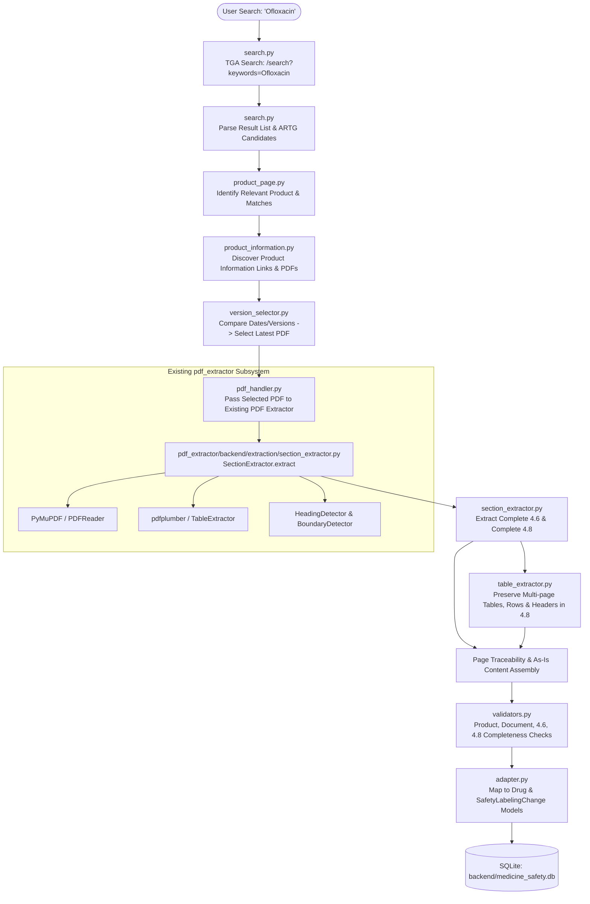

# Implementation Plan: Australia TGA Product Information & PDF Section Extraction Workflow

Implement the end-to-end Australia TGA (Therapeutic Goods Administration) medicine workflow: searching the official TGA portal, discovering Product Information (PI) web pages and PDFs, selecting the latest version by amendment/revision date, processing the PDF via the **existing** PDF extraction subsystem (`pdf_extractor`), deterministically extracting **Section 4.6** (*Fertility, Pregnancy and Lactation*) and **Section 4.8** (*Adverse Effects / Undesirable Effects*) including all multi-page tables, footnotes, and page numbers, validating the results, and persisting them into the existing database models without breaking any existing regulatory website integrations.

---

## User Review Required

> [!IMPORTANT]
> **Existing PDF Extractor Reuse**: The existing PDF extraction engine in [`pdf_extractor`](file:///Users/satya/Desktop/webcrwler/pdf_extractor) is fully utilized. No duplicate PDF parser, OCR pipeline, or table extractor is created. `backend/app/sources/australia_tga/pdf_handler.py` directly delegates extraction to the existing `SectionExtractor` (and supports HTTP microservice routing).
>
> **HTML is for Discovery Only**: TGA HTML pages are only used for searching products, locating the Product Information document, and discovering PDF URLs and version metadata. Sections 4.6 and 4.8 are **never** scraped from HTML; they are extracted strictly from the Product Information PDF.
>
> **Human Verification / Security**: As required by regulatory and security constraints, if CAPTCHA or anti-bot challenge is detected, the crawler sets `HUMAN_VERIFICATION_REQUIRED` and terminates without attempting to bypass.

---

## Architecture & Workflow



---

## Proposed Changes

### Australia TGA Module (`backend/app/sources/australia_tga/`)

Reorganize and modularize `backend/app/sources/australia_tga/` into clean, single-responsibility files as required:

#### [NEW] [config.py](file:///Users/satya/Desktop/webcrwler/backend/app/sources/australia_tga/config.py)
- Configuration constants: `TGA_BASE_URL`, `TGA_SEARCH_URL`, `SOURCE_ID`, request headers, timeouts.
- Standard section names and stop boundaries:
  - 4.6: "4.6. FERTILITY, PREGNANCY AND LACTATION"
  - 4.8: "4.8. ADVERSE EFFECTS (UNDESIRABLE EFFECTS)"
- Missing section strings:
  - `4.6:\nNOT FOUND IN THIS PRODUCT INFORMATION DOCUMENT`
  - `4.8:\nNOT FOUND IN THIS PRODUCT INFORMATION DOCUMENT`
- Curated reference registry for resilience against Australian government CDN timeouts.
- Anti-bot / CAPTCHA detection signatures (`HUMAN_VERIFICATION_REQUIRED`).

#### [NEW] [models.py](file:///Users/satya/Desktop/webcrwler/backend/app/sources/australia_tga/models.py)
- Typed Pydantic data structures:
  - `TGASearchResult`: title, url, snippet, date, artg_number, candidate_ingredient.
  - `TGAProductMatch`: product_name, active_ingredient, sponsor, artg_number, url, is_match.
  - `TGAPIDocument`: title, pdf_url, document_date, revision_date, effective_date, version_number, source_url.
  - `ExtractedTable`: caption, page_number, columns, rows, raw_matrix, markdown, footnotes.
  - `ExtractedSection`: section_number, section_title, start_page, end_page, page_numbers, text_content, tables, footnotes, is_present.
  - `TGARegulatoryResult`: complete final record ready for persistence and API response.

#### [NEW] [date_parser.py](file:///Users/satya/Desktop/webcrwler/backend/app/sources/australia_tga/date_parser.py)
- Extracts and normalizes Australian date formats:
  - "18 February 2026", "2024-03-10", "15/02/2024", "15-02-2024", "February 2024".
- Regex matching for amendment/revision notices:
  - "Date of most recent amendment: <date>"
  - "Date of revision of the text: <date>"
  - "Date of first approval: <date>"
- Version parsing: "v1.2", "Version 2.0", "Revision 3".

#### [NEW] [search.py](file:///Users/satya/Desktop/webcrwler/backend/app/sources/australia_tga/search.py)
- Executes query against `https://www.tga.gov.au/search?keywords={query}`.
- Detects security challenges / CAPTCHA (sets `HUMAN_VERIFICATION_REQUIRED` and terminates cleanly).
- Parses search result nodes (Drupal views, articles, search items), extracting titles, links, snippets, dates, and ARTG identifiers (`AUST R` / `AUST L`).

#### [NEW] [product_page.py](file:///Users/satya/Desktop/webcrwler/backend/app/sources/australia_tga/product_page.py)
- Opens product result pages.
- Filters and matches candidate results against user query (using active ingredient, product name, brand name, ARTG ID).
- Locates links to Product Information (PI) registrations and documents.

#### [NEW] [product_information.py](file:///Users/satya/Desktop/webcrwler/backend/app/sources/australia_tga/product_information.py)
- Discovers Product Information documents on product pages.
- Discovers direct and indirect PDF links (`.pdf`, `/pi/`, `/prescription-medicines-registrations/`).
- Extracts available document dates, revision dates, and version indicators for each document candidate.

#### [NEW] [version_selector.py](file:///Users/satya/Desktop/webcrwler/backend/app/sources/australia_tga/version_selector.py)
- Compares dates and versions across candidate PI documents.
- Applies strict priority:
  1. Explicit revision/amendment date
  2. Official Product Information date
  3. Official version metadata
  4. Document timestamp / metadata
- Selects the latest valid Product Information PDF without relying on search order or alphabetical filenames.

#### [NEW] [pdf_handler.py](file:///Users/satya/Desktop/webcrwler/backend/app/sources/australia_tga/pdf_handler.py)
- Connects discovered PDF to the **existing** PDF extraction subsystem (`pdf_extractor`).
- Supports direct in-process execution (`SectionExtractor`) with fallback to HTTP microservice (`http://localhost:8001/api/extract`).
- Resolves PDF from URL (fetches into memory/temp cache) or local file path.
- Returns the structured extraction result containing text, blocks, page numbers, and tables.
- **Zero duplicate PDF parsing logic**.

#### [NEW] [table_extractor.py](file:///Users/satya/Desktop/webcrwler/backend/app/sources/australia_tga/table_extractor.py)
- Formats and preserves adverse reaction tables discovered in Section 4.8.
- Preserves headers, columns (System Organ Class, Frequency, Adverse Reaction), rows, merged cells, notes, and symbols.
- Handles multi-page table continuation across page boundaries while maintaining page traceability.

#### [NEW] [section_extractor.py](file:///Users/satya/Desktop/webcrwler/backend/app/sources/australia_tga/section_extractor.py)
- Responsible exclusively for isolating:
  - **4.6. FERTILITY, PREGNANCY AND LACTATION** (stops before 4.7)
  - **4.8. ADVERSE EFFECTS (UNDESIRABLE EFFECTS)** (stops before 4.9 or Section 5)
- Preserves original wording "as-is" without summarization, omission, or grammatical changes.
- Maps and preserves page numbers (e.g. `Pages: 18–20`).
- Produces exact missing section notices when not present (`4.6:\nNOT FOUND IN THIS PRODUCT INFORMATION DOCUMENT`).

#### [NEW] [validators.py](file:///Users/satya/Desktop/webcrwler/backend/app/sources/australia_tga/validators.py)
- Validates that the product matches the query.
- Validates that the document is a true Product Information (PI) document (not CMI or consumer leaflet).
- Validates that the latest version was selected.
- Validates extraction completeness of Section 4.6 and Section 4.8.

#### [MODIFY] [crawler.py](file:///Users/satya/Desktop/webcrwler/backend/app/sources/australia_tga/crawler.py)
- Orchestrates the full discovery-to-extraction pipeline:
  `Search -> Product Page -> Product Information -> Version Selector -> PDF Handler -> Section Extractor -> Table Extractor -> Validators -> Regulatory Result`.
- Handles network errors, timeouts, and fallback gracefully.

#### [MODIFY] [adapter.py](file:///Users/satya/Desktop/webcrwler/backend/app/sources/australia_tga/adapter.py)
- Adapts `crawler.py` results to `DatabaseService`.
- Saves structured records in `Drug` and `SafetyLabelingChange`:
  - `section="4.6 Fertility, Pregnancy and Lactation"`, with full original text, page numbers, PDF URL, document date.
  - `section="4.8 Adverse Effects (Undesirable Effects)"`, with full original text, structured tables, markdown tables, page numbers, PDF URL, document date.
- Preserves backward compatibility with existing `search()` signatures and callers.

#### [MODIFY] [__init__.py](file:///Users/satya/Desktop/webcrwler/backend/app/sources/australia_tga/__init__.py)
- Exports `AustraliaTGACrawler`, `tga_crawler`, `AustraliaTGAAdapter`, `tga_adapter`, and new modular components.

#### [MODIFY] [tga_crawler.py](file:///Users/satya/Desktop/webcrwler/backend/app/sources/australia_tga/tga_crawler.py)
- Retained and aliased to `AustraliaTGACrawler` to preserve complete backward compatibility with any legacy imports.

---

### Tests (`backend/app/sources/australia_tga/tests/`)

#### [NEW] [test_search.py](file:///Users/satya/Desktop/webcrwler/backend/app/sources/australia_tga/tests/test_search.py)
- Tests live and mock TGA search, query encoding, result node extraction, snippet and ARTG parsing, and anti-bot challenge detection.

#### [NEW] [test_product_information.py](file:///Users/satya/Desktop/webcrwler/backend/app/sources/australia_tga/tests/test_product_information.py)
- Tests product page identification, relevance filtering, Product Information link discovery, and PDF URL resolution.

#### [NEW] [test_version_selector.py](file:///Users/satya/Desktop/webcrwler/backend/app/sources/australia_tga/tests/test_version_selector.py)
- Tests version/date parsing, comparing multiple PDFs with different amendment dates (e.g. 2024 vs 2025 vs 2026), and selecting the latest valid version.

#### [NEW] [test_section_extractor.py](file:///Users/satya/Desktop/webcrwler/backend/app/sources/australia_tga/tests/test_section_extractor.py)
- Tests isolating Section 4.6 and Section 4.8 from PDF blocks, stopping strictly at 4.7 and 4.9, multi-page sections, page traceability, as-is text preservation, and handling missing sections.

#### [NEW] [test_table_extractor.py](file:///Users/satya/Desktop/webcrwler/backend/app/sources/australia_tga/tests/test_table_extractor.py)
- Tests table extraction inside Section 4.8, preserving headers, columns, rows, continuation tables across pages, and footnotes.

---

## Verification Plan

### Automated Tests
1. **TGA-Specific Test Suite**:
   ```bash
   cd backend
   .venv/bin/pytest app/sources/australia_tga/tests/ -v
   ```
2. **Full Project Regression Suite** (Verify all 152 existing tests across FDA, Health Canada, TGA, MedWatch, MHRA still pass 100%):
   ```bash
   cd backend
   .venv/bin/pytest tests/ app/sources/ -v
   ```
3. **Existing PDF Extractor Subsystem Suite**:
   ```bash
   cd pdf_extractor
   .venv/bin/pytest -v
   ```

### Manual Verification
- Test running search for `Ofloxacin` through the TGA workflow:
  - Verify that search finds the product.
  - Verify that Product Information PDF is discovered.
  - Verify that version selector picks the latest document.
  - Verify that the PDF is sent to the existing extractor.
  - Verify that Section 4.6 and Section 4.8 are extracted with complete tables, footnotes, and page numbers.
  - Verify database persistence into `medicine_safety.db`.
